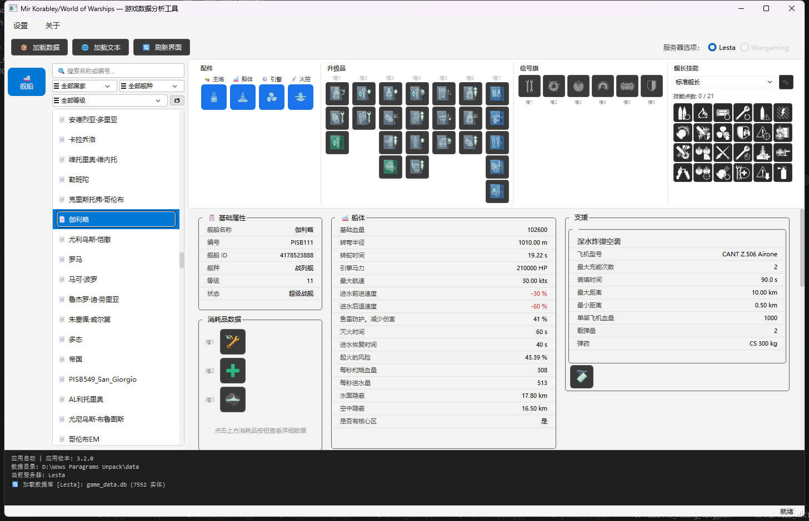

# Wows Paragrams Unpack

> 战舰世界 / Korabli 游戏数据自动化提取与分析工具

## 当前版本

[](https://github.com/walksQAQ/Wows_Paragrams_Unpack/releases/latest)

---

## 📖 简介

本工具用于从 ~~**《战舰世界》（World of Warships / Mir Korablei）**~~ **《战舰世界》（Mir Korablei）** 中提取、解析并可视化游戏数据，包括：

- 舰船数据（模块、消耗品、战斗指令等）
- 火炮、炮弹、飞机、消耗品、升级品、舰长等完整数据链
- 支持 ~~**Wargaming** 和 **Lesta** 双服务器~~ **Lesta**服务器

> 由于各种各样的原因，目前这个版本不一定支持Wargaming服（换句话说就是我没测试过，一定要用的话有可能出现各种各样的报错）

---

## ✨ 功能特性

| 功能 | 说明 |
|------|------|
| 🔓 **数据提取** | 自动从游戏目录提取最新 GameParams，且在本地保存 |
| 🖥️ **图形界面** | PySide6 构建，分类导航 + 筛选 + 详情查看 |
| 🌐 **本地化** | 自动下载语言文件，显示中文名称 |
| 📦 **单文件打包** | 基于 Nuitka 编译为独立 exe，无需 Python 环境 |


### 使用流程

```
1. ⚙ 设置 → 高级设置，配置游戏目录路径
2. 📦 点击"加载数据" — 自动提取并解析数据
3. 🌐 点击"加载文本" — 下载中文语言文件（可选）
4. 左侧选择分类 → 中间筛选文件 → 右侧查看详情
```


---
<br>

## 📸 程序主界面截图




## ⚠️ 免责声明

本工具仅用于学习和研究目的，**不包含**任何游戏官方素材或版权内容，所有游戏数据均由用户自行从其游戏客户端提取。

- 游戏相关一切内容版权归 **Wargaming.net** 或 **Lesta Studio** 所有；
- 本软件为独立实现；其中 `data_extractor/kraken.py` 为 GPLv3 移植代码，其余部分不含 GPL/LGPL 衍生代码；
- 请勿将本工具用于商业用途，或传播从游戏客户端提取的受版权保护内容。

---

## 📄 许可证

本仓库采用**双授权**结构：

- **All Rights Reserved (ARR)**：除特别声明外，其余全部代码与文档保留所有权利，未经版权所有者明确书面许可，不得以任何形式复制、分发或修改。详见 [LICENSE](./LICENSE)。
- **GPLv3**：`data_extractor/kraken.py` 基于 [kraken-decompressor](https://github.com/domdfcoding/kraken-decompressor)（GPLv3）移植，按 GNU GPL v3.0（或更高版本）授权，全文见 [LICENSE.GPLv3](./LICENSE.GPLv3)。

## 👤 作者

- **walksQAQ** — 开发维护
- 仓库: [https://github.com/walksQAQ/Wows_Paragrams_Unpack]
- 下载编译好的程序请到 **Releases** 页面查找。


## ✨ 特别鸣谢

感谢 **DeepSeek**、**GitHub Copilot**、**Gemini** 等 AI 工具在本项目开发过程中的协助，大幅降低了代码编写、逆向分析与调试的工作量。


---
<br>

## 📚 引用与技术来源

本工具为纯 Python 实现，绝大多数二进制格式分析参考了以下开源项目与官方格式规范，并结合 Ghidra 对游戏客户端的逆向验证。完整格式文档见仓库内 `docs/` 目录。

### 本项目参考

| 项目 | 用途 |
|------|------|
| [EdibleBug/WoWS-GameParams](https://github.com/EdibleBug/WoWS-GameParams) | GameParams.data 解析参考 |
| [landaire/wows-toolkit](https://github.com/landaire/wows-toolkit) | 格式与功能参考：IDX / PKG / 材质 / 模型 解析、GLB 导出、装甲查看器与格式规范 |
| [domdfcoding/kraken-decompressor](https://github.com/domdfcoding/kraken-decompressor)（C++，GPLv3） | Oodle Kraken 解压参考 |
| [powzix/kraken](https://github.com/powzix/kraken) | Kraken `DecodeBytes` / Huffman 熵解码参考 |
| [detly/oozextract](https://github.com/detly/oozextract) | Oodle 解压参考 |
| [WorkingRobot/OodleUE](https://github.com/WorkingRobot/OodleUE) | Oodle 引擎集成（2.9.15），bc7prep 纹理格式参考 |
| [LocalizedKorabli/Korabli-LESTA-L10N](https://github.com/LocalizedKorabli/Korabli-LESTA-L10N) | 本地化文本来源仓库|
| [浩舰 iwarship](https://iwarship.net/wowsdb/dap) | 部分数据界面、散布穿深计算器参考 |
| [MKtool](https://mktool.info) | 舰船详情 / 穿深计算参考 |

> **许可说明**：`kraken-decompressor`（GPLv3）对应本仓库移植文件 `data_extractor/kraken.py`，按 GPLv3 授权；`wows-toolkit` 为 MIT；其余项目仅作格式 / 算法研究参考，不构成 GPL 衍生代码。

> 3D 可视化规划中的候选库：[ModernGL](https://github.com/moderngl/moderngl)、[PyGLM](https://github.com/Zuzu-Typ/PyGLM)、[trimesh](https://github.com/mikedh/trimesh)、[pygltflib](https://github.com/teknotus/pygltflib)、[meshoptimizer](https://pypi.org/project/meshoptimizer/)

<br>