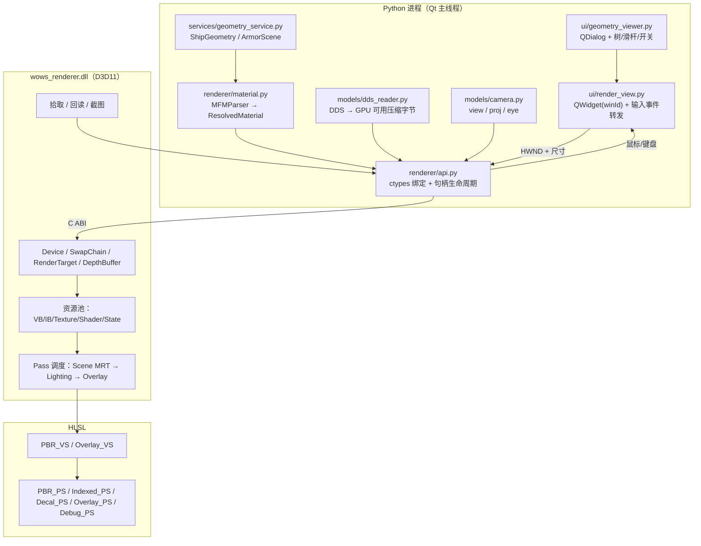
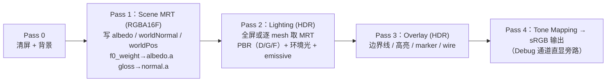

# 3D 渲染器迁移：Python + Qt + C++ D3D11 Renderer —— 架构设计

> 状态：**待办（2026-09-27 立项）**
>
> 目标：把 3D 模型/装甲查看器的渲染后端从「Python 内 PyOpenGL + GLSL」整体替换为
> 「Python(Qt) 负责数据/UI/交互 + C++ D3D11 Renderer(DLL) + HLSL 负责 GPU 渲染」。
>
> 已确认的决策（用户拍板，2026-09-27）：
> 1. **直接替换**：功能对齐后删除 OpenGL 渲染路径，不做长期双栈并存。
> 2. **桥接方式**：C++ 纯 C ABI + Python `ctypes`（不引入 pybind11，避免 Python 版本绑定与打包复杂度）。
> 3. **构建与交付**：CMake 工程，构建产物 `wows_renderer.dll` 预编译后随 `release/` 分发（Nuitka 打包时一并带上）。
> 4. **设备丢失**：**自动重建**（D3D11 工程应有的容错；纹理/几何/材质描述本来就有 CPU 侧描述可取）。
> 5. **HDR + Tone Mapping**：**本次纳入**（`_mg.B` 自发光与高光需要 >1.0 的动态范围）。**Bloom 不纳入**，列为 P9。
> 6. **蒙皮**：**本阶段 Python 侧预计算**，沿用已验证的调色板/蒙皮逻辑，不为「架构漂亮」重写。
> 7. **离屏渲染**：**允许作为降级路径**，但不作为 P0 默认；先解决原生窗口嵌入。
> 8. **HLSL 编译**：**构建期 `fxc` → `.cso` 内嵌 / 随 DLL 发布**（启动快、打包简单、用户机器无需编译环境）。
>
> ⚠️ **最高优先级实施约束（见 §1.4）**：P0～P8 期间禁止以「优化」「标准化 PBR」「修正旧实现」
> 为理由改变现有渲染算法；所有行为变化必须单独记录，并通过旧 OpenGL / 新 D3D11 的 A/B 截图确认。
>
> 关联文档：
> - `docs/materials-format.md`（.mfm 明文材质属性语义）
> - `docs/shaders-format.md`（shader/fx 容器、资源绑定与参数表）
> - `docs/dds-format.md`（DDS/DX10 头、DXGI 格式、bc7prep）
> - `docs/geometry-format.md`（.geometry 二进制布局）
> - `todo_list/New_function_of_unpack_geo_and_display.md`（几何/装甲数据链与 GLB 导出）
> - `todo_list/New_function_of_fix_indexed_render_and_export_glb.md`（INDEXED 渲染修正与转码）

---

## 一、现状盘点

### 1.1 现有渲染栈

| 层 | 位置 | 说明 |
|---|---|---|
| 渲染器 | `ui/geometry_renderer.py`（约 2600 行） | `QOpenGLWidget` + PyOpenGL；含 GLSL 源码（`VERT_SRC` / `FRAG_PBS` / `FRAG_FX` / `FRAG_INDEXED`）、`GpuMesh`、MRT FBO、多趟绘制 |
| 查看器 UI | `ui/geometry_viewer.py` | 独立 QDialog、树形装甲筛选、不透明度/开关、导出 GLB、marker、截图 |
| 相机 | `models/camera.py` | `OrbitCamera` + AABB 8 角精确框选 |
| 几何解析 | `models/geometry_parser.py`、`models/geometry_transform.py` | .geometry 解析（含蒙皮）、坐标空间统一变换 |
| 装甲聚合 | `models/armor_scene.py` | 三角形汤 + zone/part/厚度分组 + 边界线 + `ray_pick` |
| 数据装配 | `services/geometry_service.py` | `ShipGeometry` / `HullMesh` / `MountMesh` / `ArmorMesh`，材质解析与 INDEXED 参数透传 |
| 纹理解析 | `models/dds_reader.py` | DDS 头/bc7prep/DX10 解析，数组纹理 layer-major → mip-major 重排 |
| 导出 | `services/export_service.py` | GLB（渲染模型 / 装甲模型），独立于渲染器 |

### 1.2 现有渲染器已实现的渲染行为（迁移必须逐项对齐）

1. **实体 PBS 材质**：`_a`(albedo) / `_n`(normal) / `_mg`(F0 权重 + gloss + emissive 掩码) / `_ao`，加 sRGB 色彩管线。
2. **INDEXED 分块材质**：`materialIdMap` 采样取 matId → 逐 matId 的 UV 变换与瓦片层选择 → `albedoArray` / `normalArray` / `MGArray` 采样 → tint 混合 → art 叠加。
3. **Normal Detail 层（decal）**：独立 mesh、独立 UV 体系，需要「原材质未打光 albedo + 世界法线」参与合成。
4. **MRT 局部 deferred compositing**：附件0 = 未打光 albedo（linear，`.a` 存 F0 混合权重）、附件1 = 世界法线（`.a` 存 `_mg.G` 原值，光照时取 `roughness = 1 - gloss`）、附件2 = 世界坐标（点光源重建位置）+ 深度。
5. **光照**：点光源（位置+衰减）+ 环境光保底；GGX/D-G-F 的 Cook-Torrance 高光；MG 不影响基础色（`.R` 只作 F0 混合权重、`.G` 只作粗糙度来源、`.B` 只作 emissive 掩码）。
6. **材质族分支**：PBS / INDEXED / emissive（无光直显 + 自发光强度）/ alpha 混合（玻璃）/ grid / wire（线框）/ albedo-decal。
7. **装甲视图**：平涂 + 不透明度 + 边界线（深度偏移、不写深度）+ 悬停/选中高亮（法线偏移）+ 船体垫底。
8. **可视化开关**：按 mesh/材质/组件/厚度板过滤、`set_visible_tris` 索引重建、板块拾取与树联动。
9. **实例化**：挂载件 `instance_matrices` 的 instanced 绘制，含实例属性与单次绘制混用的正确性约束。
10. **蒙皮**：`skinned_applied` + 骨骼调色板（调色板在 CPU 侧应用）。
11. **调试视图**：模型名标注、最终法线、F0 混合权重、粗糙度的通道直显。
12. **截图**：`F12` 抓取当前帧写 PNG。

> ⚠️ 第 2/3/5 项的公式与通道语义已定版，迁移到 HLSL 时**只换语言不换算法**（见 §1.4 铁律），
> 否则会重复踩一遍已解决的定位过程。

### 1.3 现状问题（迁移动机）

- 全部 GL 调用与渲染逻辑挤在单个 2600 行模块里，UI 事件、GL 状态、shader 分支强耦合。
- GL 上下文相关的隐式约束多（上下文内外、绑定顺序、错误吞掉导致整帧丢失），排错成本高。
- 材质系统是「按材质类型 + 个别属性打补丁」，与「property 驱动的通用材质」目标相悖。
- 未来要接 `parentMfm` 继承、更多 shader 族、HDR/Bloom 时，OpenGL 路线收益递减。

### 1.4 迁移最高优先级约束（铁律）

> **P0～P8 期间禁止以「优化」「标准化 PBR」「修正旧实现」为理由改变现有渲染算法。**
> 所有行为变化必须单独记录，并通过旧 OpenGL / 新 D3D11 的 A/B 截图确认。

**必须原样搬运（只换语言/API，不动算法）：**

```
旧 Renderer（已验证）
    │
    ├── 算法               ┐
    ├── 数据解释           │
    ├── UV 约定            │
    ├── INDEXED 公式       ├── 原样搬运 ──→ D3D11 / HLSL
    ├── 材质语义           │
    └── 通道分配           ┘
```

**禁止改造为：**

```
旧 OpenGL → 「理解一下」→ 重新实现一个更标准的 PBR   ❌
```

后者极易得到一个「视觉上挺漂亮、但和实际表现不一致」的渲染器，且会把已定位的坑全部作废
（`_mg` 被错误影响 diffuse、法线贴图「有数据但没效果」、材质分块接缝、decal 法线、
INDEXED 计算、mip/point 采样、挂点关系、绕序/坐标空间等）。

**本次唯一允许的「行为变化」清单（已获批准）：**

| 允许的变化 | 说明 |
|---|---|
| 语言 / API / 资源管理 | GLSL → HLSL，GL 状态 → D3D11 state object |
| 窗口集成 | `QOpenGLWidget` → `QWidget` + 子 HWND + 交换链 |
| 输出链路 | 加入 HDR 渲染目标 + Tone Mapping（见 §7） |
| 设备丢失恢复 | 新增容错能力（无 GPU 侧旧实现可对照） |
| 线程/生命周期守卫 | 删除 `makeCurrent` / `_gl_ready` 类守卫（DLL 内部串行化） |

除此之外任何数值、公式、通道、采样方式的差异，都属于**必须归因的回归**。

---

## 二、目标架构总览

核心原则：**材质与渲染器解耦**。Python 产出「与后端无关的场景/材质描述」，DLL 只消费描述，
不感知 MFM、parentMfm、assets.bin、DDS 文件等游戏资产概念。



数据流：

```
游戏资产 → geometry_service / dds_reader / MFMParser
        → 与后端无关的 SceneDesc / MaterialDesc（纯数据）
        → ctypes 调用 C ABI
        → D3D11 资源 + HLSL 绘制
        → 交换链呈现到 QWidget 的子 HWND
```

**关键边界**：`renderer/material.py` + `renderer/api.py` 之上是 Python 语义（材质继承、属性驱动、游戏格式），
之下是 D3D11 语义（资源、状态、pass）。两者之间只有 C ABI，不共享结构体定义之外的任何假设。

---

## 三、目录与模块布局

```
renderer/                        # 新增：Python 侧渲染前端
    __init__.py
    api.py                       # ctypes 声明、句柄封装、枚举映射
    types.py                     # ctypes.Structure ↔ Python dataclass 转换
    material.py                  # MaterialDefinition / ResolvedMaterial / resolve
    mfm_parser.py                # .mfm（明文 + 二进制）解析，含 parent 链
    texture.py                   # 纹理注册、缓存、key 管理（含 sRGB/repeat/array 标志）
    scene.py                     # SceneBuilder：把 ShipGeometry/ArmorScene 转成 MeshDesc 列表
    viewport.py                  # 相机状态、帧驱动、输入 → 相机/拾取
native/
    include/wows_renderer.h      # 唯一公共头（C ABI）
    src/renderer.cpp             # 设备/交换链/帧循环
    src/resources.cpp            # VB/IB/Texture/Shader/State 池
    src/scene.cpp                # 场景对象与可见性
    src/pass_scene.cpp           # Pass1：MRT 写入（albedo / normal / worldpos / f0_weight / gloss）
    src/pass_lighting.cpp        # Pass2：PBR 光照合成
    src/pass_overlay.cpp         # Pass3：边界线/高亮/marker/debug
    src/pick.cpp                 # 拾取 / 帧回读 / PNG 截图
    shaders/
        common.hlsl              # PBR 函数库（与现有 GLSL 公式一一对应）
        pbr.hlsl                 # PBS 材质像素着色器
        indexed.hlsl             # INDEXED 分块材质
        decal.hlsl               # Normal Detail 层
        overlay.hlsl             # 线框/边界线/高亮/标注
        fullscreen.hlsl          # debug 通道直显 / 后期
    CMakeLists.txt
ui/
    geometry_viewer.py           # 保留（UI 骨架），渲染控件引用改为 render_view
    render_view.py               # 新增：承载 DLL 渲染面的 QWidget（替换 QOpenGLWidget 子类）
    geometry_renderer.py         # ❌ 删除（逻辑拆入 renderer/ 与 native/）
third_party/                     # 若无外部依赖则不需要
release/
    wows_renderer.dll            # 随包分发
```

**删除/替换清单**：

| 现有 | 处置 |
|---|---|
| `ui/geometry_renderer.py` | 删除。GLSL → `native/shaders/*.hlsl`；`GpuMesh` → `native/src/resources.cpp`；`GeometryViewport` → `renderer/viewport.py` + `ui/render_view.py` |
| `requirements.txt` 的 `PyOpenGL` | 移除（`numpy`/`meshoptimizer` 仍需要） |
| `models/dds_reader.py` | 保留（只保留「解析 + 重排」职责，输出改为 GPU 可直接上传的压缩字节 + 格式枚举） |
| `models/camera.py` | 保留，扩展为输出 `view`/`proj`/`eye` 供每帧上传 |
| `models/armor_scene.py` | 保留（`ray_pick` 继续走 CPU，见 §8.3） |
| `services/export_service.py` | 不受影响（GLB 导出与渲染后端无关） |
| 各处 `_run_gl` / `makeCurrent` / `_gl_ready` 守卫 | 删除（DLL 内部串行化，不需要上下文守卫） |

---

## 四、C ABI 设计

### 4.1 约定

- 单一头文件 `native/include/wows_renderer.h`，`extern "C"`，导出宏 `WSR_API`。
- 所有结构体首字段 `uint32_t struct_size`，便于后续扩展；不传 `bool`（用 `uint32_t`）。
- 字符串一律 `const char *`（UTF-8，NUL 结尾，调用期间有效，DLL 内部拷贝）。
- 句柄不透明：`typedef struct wsr_renderer wsr_renderer;` / `typedef struct wsr_mesh wsr_mesh;`。
- 所有函数返回 `int32_t`（0 = 成功，负 = 错误码）；`wsr_last_error()` 返回最近一次错误文本。
- **线程约定**：所有调用必须在创建 renderer 的同一线程（即 Qt 主线程）；DLL 内部不自建线程。
- **资源生命周期**：`wsr_*_create` 返回的资源句柄在 `wsr_destroy` 时统一释放；单帧内可随时更新。

### 4.2 接口清单（草案）

```c
/* ---------- 生命周期 ---------- */
WSR_API int32_t wsr_create(void *hwnd, uint32_t w, uint32_t h, uint32_t flags, wsr_renderer **out);
WSR_API void    wsr_destroy(wsr_renderer *r);
WSR_API int32_t wsr_resize(wsr_renderer *r, uint32_t w, uint32_t h);   /* 交换链 + 离屏目标重建 */
WSR_API int32_t wsr_set_dpi_scale(wsr_renderer *r, float scale);        /* 高 DPI 后备缓冲 */
WSR_API int32_t wsr_render(wsr_renderer *r);                            /* 呈现一帧 */
WSR_API const char *wsr_last_error(void);

/* ---------- 相机 ---------- */
WSR_API int32_t wsr_camera_set(wsr_renderer *r, const float *view16, const float *proj16,
                               const float *eye3, const float *light_pos3);

/* ---------- 纹理（key 由调用方命名，重复注册同 key = 覆盖）---------- */
WSR_API int32_t wsr_texture_upload(wsr_renderer *r, const char *key,
                                   const wsr_texture_desc *desc);
/* desc: { struct_size, kind: 2D|2D_ARRAY|CUBE, format: BC1/BC3/BC4/BC5/BC7/RGBA8/...,
           width, height, array_size, mip_count, flags: SRGB|REPEAT|POINT,
           data, size, mip_offsets[], slice_offsets[] } */

/* ---------- 场景（一次性提交一批 mesh，走内部资源池增量更新）---------- */
WSR_API int32_t wsr_scene_begin(wsr_renderer *r);
WSR_API int32_t wsr_scene_add_mesh(wsr_renderer *r, const wsr_mesh_desc *desc);
WSR_API int32_t wsr_scene_end(wsr_renderer *r);        /* 一次性建/更新 GPU 资源 */
WSR_API int32_t wsr_scene_clear(wsr_renderer *r);

/* ---------- 运行时状态（不回传几何，只改状态）---------- */
WSR_API int32_t wsr_mesh_set_visible(wsr_renderer *r, const char *mesh_key, uint32_t visible);
WSR_API int32_t wsr_mesh_set_indices(wsr_renderer *r, const char *mesh_key,
                                     const uint32_t *indices, uint32_t count);
WSR_API int32_t wsr_mesh_set_view_mask(wsr_renderer *r, const char *mesh_key, uint32_t mask);
WSR_API int32_t wsr_material_set_params(wsr_renderer *r, const char *mesh_key,
                                        const wsr_material_override *ov);
WSR_API int32_t wsr_render_options_set(wsr_renderer *r, const wsr_render_options *opt);
/* opt: { opacity, show_edges, edge_color[4], hull_backdrop_opacity, debug_view, light_intensity, tone_map } */

/* ---------- 查询 ---------- */
WSR_API int32_t wsr_pick(wsr_renderer *r, int32_t x, int32_t y, char *out_key,
                         uint32_t key_cap, float *out_depth);
WSR_API int32_t wsr_hit_test_batch(wsr_renderer *r, const int32_t *xy, uint32_t count,
                                   char *out_keys, uint32_t key_stride, uint32_t key_cap);
WSR_API int32_t wsr_capture_png(wsr_renderer *r, const char *path);
WSR_API int32_t wsr_stats(wsr_renderer *r, wsr_stats *out);   /* draw calls / fps / vram */
```

### 4.3 场景描述结构体（核心契约）

```c
typedef struct wsr_vertex {
    float pos[3];       /* 渲染空间（右手系 Y 上，Z 已镜像） */
    float normal[3];
    float tangent[4];   /* w = 手性/符号位，无切线时 (0,0,0,1) */
    float uv[2];
} wsr_vertex;

typedef struct wsr_material_desc {
    uint32_t struct_size;
    const char *name;              /* 材质名，用于调试与 shader 族选择日志 */
    uint32_t shader_family;        /* WSR_SHADER_PBS / INDEXED / EMISSIVE / DECAL / WIRE / GRID / GLASS */
    uint32_t flags;                /* WSR_MAT_ALPHA / TWO_SIDED / USE_VERTEX_COLOR / NO_MIP ... */

    /* ⚠️ 参数命名遵循「复刻现有渲染器语义」原则，禁止使用 metallic / smoothness：
     *      f0_weight = _mg.R 的 F0 混合权重（不是 metallic，见 §5.4.1）
     *      roughness = 1.0 - _mg.G（_mg.G 原始语义是 gloss）
     *      emissive_strength = 自发光强度，最终 emissive 贡献 = base_color × _mg.B × 该值
     */
    float base_color[4];
    float f0_weight, roughness, emissive_strength, normal_strength;
    uint32_t override_mask;        /* bit0 f0_weight / bit1 roughness / bit2 emissive */
    float uv_scale[2], uv_offset[2];

    /* 纹理 key（先经 wsr_texture_upload 注册；空字符串 = 无此通道） */
    const char *tex_diffuse;       /* _a  / INDEXED: diffuseMap（可能是占位） */
    const char *tex_normal;        /* _n  / _alpha_n */
    const char *tex_mg;            /* _mg */
    const char *tex_ao;
    const char *tex_matid;         /* INDEXED materialIdMap */
    const char *tex_tiles_a;       /* INDEXED albedoArray（2D_ARRAY） */
    const char *tex_tiles_n;       /* INDEXED normalArray */
    const char *tex_tiles_mg;      /* INDEXED MGArray */
    const char *tex_art;
    const char *tex_noise;

    /* INDEXED 逐 matId 数组（每项 count*4 个 float，count = matid_count） */
    uint32_t matid_count;
    const float *arr_tint;
    const float *arr_remove_tint;
    const float *arr_offset_scale;
    const float *arr_rotation;
    const float *arr_tile_idx;
    const float *arr_art_strength;
} wsr_material_desc;

typedef struct wsr_mesh_desc {
    uint32_t struct_size;
    const char *key;               /* 稳定唯一键，如 "MidBack#TL2_SHIPMAT_INDEXED_PBS_Hull" */
    uint32_t kind;                 /* WSR_MESH_HULL / MOUNT / ARMOR */
    const wsr_vertex *vertices;  uint32_t vertex_count;
    const uint32_t *indices;     uint32_t index_count;
    const float *model_matrix;     /* 16 float 行主序；NULL = 单位阵 */
    const wsr_material_desc *material;
    /* 可选：GPU 侧实例化 */
    const float *instance_matrices; uint32_t instance_count;
    /* 可选：骨骼调色板（CPU 侧已算好的世界矩阵），DLL 只做常量缓冲上传 */
    const float *bone_matrices;    uint32_t bone_count;
    /* 可选：附加几何（装甲边界线等），同 key 下的第二组 index */
    const uint32_t *line_indices;  uint32_t line_count;
} wsr_mesh_desc;
```

设计要点：

- **材质覆盖统一走 `override_mask` + `lerp`**，不在 HLSL 里写 `if` 分支：
  `final = lerp(texValue, overrideValue, weight)`，weight ∈ {0,1} 由 mask 决定。
- **INDEXED 数组一次性上传**（196×4），DLL 只把它们放进 `cbuffer`，逐材质的 UV 逻辑在 HLSL 中按定版公式执行。
- **mesh key 是唯一交互句柄**：可见性、索引替换、拾取、调试标注都通过 key，不依赖索引位置。
- **蒙皮在 Python 侧完成**（沿用现有调色板逻辑），DLL 只接收已完成蒙皮的顶点或骨骼矩阵（二选一，见 §9 风险）。

---

## 五、材质系统设计

### 5.1 三层模型

```
MaterialDefinition   # 单份 .mfm 的原始内容（可能是 child，含 parent 引用）
      ↓ resolve()
ResolvedMaterial     # 继承补齐后的、与后端无关的最终材质
      ↓ to_material_desc()
wsr_material_desc    # C ABI 契约
```

```python
@dataclass
class MaterialDefinition:
    name: str
    parent: str | None = None            # parentMfm 引用（同一 VFS 解析器解析）
    fx: str | None = None                # shader/fx 名，如 ship_material_indexed.fx
    shader_id: int | None = None         # 高 16 位 = 效果族
    properties: dict[str, "PropertyValue"]   # 只含「本文件声明」的属性

@dataclass
class ResolvedMaterial:
    name: str
    chain: list[str]                     # 继承链，便于调试/日志
    fx: str | None
    family: str                          # pbs / indexed / emissive / decal / wire / grid / glass
    textures: dict[str, str]             # 语义槽 → 纹理 key（缺失 = 该通道不参与）
    floats: dict[str, float]
    vectors: dict[str, tuple[float, ...]]
    arrays: dict[str, list[tuple[float, ...]]]   # INDEXED 的 vec4 数组
    declared: set[str]                   # 本链路实际声明过的属性名集合
```

### 5.2 属性驱动（现有定版原则，迁移后必须保持）

- `properties` 里出现什么 shader property，就代表该材质提供什么渲染数据；
  **未声明 = 该通道不参与**，绝不用默认纹理补齐。
- 区分「property 不存在」与「property 存在但值为空」。
- 决定画法的是 `fx + shader_id + g_mode + property 集合` 四者，而不是单个 property。
- 只声明 `g_normalMap` 的材质是 **Normal Detail / Normal Overlay 层**，不是「只有 Normal 的 PBR 材质」：
  它不替换下层 albedo/roughness/F0 权重/AO，只对最终法线做增强。
- **不用**「属性名含 normalMap 就调用固定 Normal 渲染函数」这类硬编码推导。

### 5.3 parentMfm 继承与解析顺序

从设计之初就预留（避免后期重构）：`child.mfm → parent.mfm → grandparent.mfm` 链式解析，
子文件覆盖父文件的同名属性；纹理槽与参数分组按「子优先」合并。

```python
def resolve_material(defn, resolver, _stack=None) -> ResolvedMaterial:
    # 1) 解析 parent（带环检测：_stack 中出现过的 name 直接报错）
    base = resolve_material(resolver(defn.parent), resolver, ...) if defn.parent else empty()
    # 2) 用本文件的已声明属性覆盖 base
    # 3) family 由 fx + shader_id 高位决定（属性集合仅作一致性校验）
    # 4) 规则校验：INDEXED 缺 materialIdMap/albedoArray → 记 warning，不静默补默认
    return merged
```

解析顺序建议：MFM 文件 → 单份 `MaterialDefinition` → 链式 `resolve` → `ResolvedMaterial` →
`scenebuilder` 分配到 mesh → `to_material_desc()`。**Renderer 完全不知道 parentMfm 存在。**

### 5.4 纹理槽与通道语义（已定版，保持不变）

| 语义槽 | 典型文件 | 通道 |
|---|---|---|
| `diffuseMap` / `g_diffuseMap` | `*_a.dds` / `.dd0` | RGB = albedo |
| `normalMap` / `g_normalMap` | `*_n.dds` / `*_alpha_n.dds` | RGB = 切线空间法线 |
| `metallicGlossMap` / `MGArray` | `*_mg.dds` | **R = F0 混合权重，G = gloss（粗糙度来源），B = emissive 掩码** |
| `ambientOcclusionMap` | `*_ao.dds` | R = AO |
| `materialIdMap` | `*_matid.dds` | R = 材质 ID |
| `albedoArray` / `normalArray` | 图集数组纹理 | 按 matId 选定层采样 |
| `artMap` | `*_art.dds` | 艺术涂装叠加层（非颜色基底） |

#### 5.4.1 代码层命名（⚠️ 禁止改回 `metallic`）

| 贴图通道原值 | 派生量 | C ABI / HLSL 参数名 | 说明 |
|---|---|---|---|
| `_mg.R` | F0 混合权重 | `f0_weight` | `F0 = mix(vec3(0.04), albedo, f0_weight)`。**语义不是 metallic**，只是形式恰好相同 |
| `_mg.G`（gloss） | `roughness = 1 - gloss` | `roughness` | 贴图里存的是 gloss（高 = 光滑），光照阶段用 roughness |
| `_mg.B` | emissive 掩码 | `emissive` / `emissive_strength` | 与 `base_color`、强度相乘后加到线性颜色 |

> **为什么不用 `metallic` 这个名字**：`_mg.R → F0` 与标准 PBR 的 `metallic → 推导 F0`
> 是两个不同概念。命名失真的直接后果，就是几个月后看到 `metallic = mg.r;` 时
> 忘记为何这么写，进而「顺手改成标准 PBR」。

**硬性约束（迁移时必须保留）：**

- `_mg` **不参与基础颜色**：`f0_weight` 只经 F0 影响高光颜色与强度；
  `roughness` 只影响高光宽度；`.B` 单独作为 emissive 掩码。**不做** `kd=(1-F)*(1-metallic)` 削弱漫反射。
- **法线以法线贴图为准**：有法线贴图时解码值直接作为世界法线，不用几何法线重建 TBN；
  无法线贴图时才回退 `normalize(v_normal)`。
- **自发光**：`emissive 贡献 = base_color.rgb × _mg.B × emissive_strength`，加到最终线性颜色，不受光照影响。
- **色彩管线**：贴图以 sRGB 内部格式上传，硬件逐 texel 解码；shader 只做线性 → sRGB 输出编码。
  数据类贴图（materialIdMap / MG / normal）按**非 sRGB** 上传（否则 sRGB 解码破坏数据）。
- **金属不反射程序化天空盒**：不使用随视角变化的反射色（历史教训：色相随反射方向乱变）。

#### 5.4.2 通道实现与验证状态（增量推进）

迁移按**通道逐个打通**推进：先把框架（槽位声明、类型校验、debug 直显、A/B 取证）搭稳，
再一个通道一个通道送入并逐项验证。**凡标 ✅ 的通道，其上传与采样已被量化验证锁定，后续改动不得使其退化。**

| 通道 | 槽位（HLSL） | 上传类型 | 状态 | 验证依据 |
|---|---|---|---|---|
| `_a` albedo（PBS `diffuseMap`） | `t0` `g_tex` | `Texture2D`，sRGB 类型化 | ✅ **已验证** | 反照率直显与源 DDS 解码统计一致（均值差 ≤4/255，色调一致） |
| `_a` albedo（INDEXED `albedoArray`） | `t4` `g_tiles_tex` | `Texture2DArray`，非 sRGB | ✅ **已验证** | 逐切片均值范围 34–172，渲染结果落于该范围内且标准差 37（有真实细节，非占位） |
| `_n` 法线（PBS） | `t1` `g_normal_map` | `Texture2D`，非 sRGB | ⬜ 待逐项验证 | 采样已接通，输出与旧版对比待做 |
| `_n`（INDEXED `normalArray`） | `t5` `g_normal_tex` | `Texture2DArray`，非 sRGB | ⬜ 待逐项验证 | 同上 |
| `_alpha_n`（INDEXED `normalMap` 叠加层） | `t9` `g_alpha_n_map` | `Texture2D`，非 sRGB | ⬜ 待逐项验证 | ⚠️ 与 PBS 的法线槽 **`t1` 不是同一个槽**，两族不得混用 |
| `_mg`（F0/gloss/emissive） | `t2` `g_mg_map` / `t6` `g_mg_tex` | `Texture2D` / `Array`，非 sRGB | ⬜ 待逐项验证 | — |
| `materialIdMap` | `t3` `g_matid_tex` | `Texture2D`，非 sRGB，point 采样 | ⬜ 待逐项验证 | 采样与绑定已证明正常（本通道尚有未解差异，详见 §7.4 备注） |
| `artMap` | `t7` `g_art_tex` | `Texture2D`，sRGB | ⬜ 待逐项验证 | — |
| `noise` | `t8` `g_noise_tex` | `Texture2DArray` | ⬜ 待逐项验证 | — |

**框架约束（防回归，必须保持）：**

1. **槽位类型校验**：绑定前校验「2D 槽 ↔ 2D 纹理 / 数组槽 ↔ 数组纹理」，不匹配则**跳过并告警**而不是强行绑定。
   HLSL 声明的资源维度不符会读写越界或读到无关数据，属于最难排查的一类问题。
   典型违规：INDEXED 的主贴图是 **数组** 纹理，不得落进声明为 `Texture2D` 的 `t0`（其正确定位是 `t4`）。
2. **INDEXED 与 PBS 两族槽位分开**：`normalMap` 在 INDEXED 族是**叠加层**（`t9`），在 PBS 族才是法线（`t1`）；
   `diffuseMap` / `g_diffuseMap` / `g_albedoMap` 属于**另一套**资源组，不得覆盖主贴图。
3. **顶点 UV 的 V 轴方向**：旧渲染栈上传 UV 原值（GL 约定 t=0 在底部），D3D 约定 v=0 在顶部，
   因此网格 UV 采样点统一施加 V→1−V 校正；公式仍以 GL 空间书写，便于与旧实现逐行对照。
4. **非 sRGB 数据贴图**：`materialIdMap` / MG / normal 一律按非 sRGB 上传，sRGB 解码会破坏数据语义。

**Debug 通道编号（`debug_view`，Pass 4 旁路 Tone Mapping）：**

| 编号 | 内容 | 说明 |
|---|---|---|
| 0 | 无（正常输出） | — |
| 1 | 模型标记 | marker |
| 2 | 最终法线 | 世界法线可视化 |
| 3 | `f0_weight` | `_mg.R` |
| 4 | `roughness` | `1 - _mg.G` |
| 5 | art 覆盖强度 | `artMap.a × 强度` |
| 6 | matId | 材质 ID 可视化 |
| **7** | **反照率 `_a` 直显** | 输出**贴图存储原值**（sRGB 通道反编码回存储域），可与 Python 解码的源 DDS **逐像素比对**，是通道上传正确性的取证通道 |

> 新增通道时：先在 `material.hlsl` 按「输出贴图存储原值」的约定加 debug 分支，
> 再用 `_temp/scripts/verify_albedo.py` 一类的探针把**渲染结果与源 DDS 解码统计**对齐，
> 通过后再更新上表状态。

### 5.5 材质参数覆盖（MFM → shader）

```
Texture Value  ──┐
                 ├─ lerp ──→ Final Value ──→ PBR 光照
Material Value ──┘
   (weight = override_mask 位)
```

在 C ABI 侧表现为 `override_mask` 三个 bit；在 HLSL 侧表现为三行 `lerp`：

```hlsl
final.f0_weight = lerp(mg.r,         mat.f0_weight,         bit0);
final.roughness = lerp(1.0 - mg.g,   mat.roughness,         bit1);
final.emissive  = lerp(mg.b,         mat.emissive_strength, bit2);
```

覆盖值语义与现有渲染器完全一致，**不引入「按 metallic 重算 F0」的新路径**。

---

## 六、纹理/DDS 管线

### 6.1 职责划分（保持 Python 侧已有能力）

| 步骤 | 归属 | 说明 |
|---|---|---|
| 容器/头解析（DDS、DX10 扩展头、bc7prep 检测） | Python `models/dds_reader.py` | 已有实现 |
| **数组纹理 layer-major → mip-major 重排** | Python | 已有定版修正，必须保留 |
| DXGI 格式 → 枚举映射 | Python | `BC1/BC3/BC4/BC5/BC7/BC6H/RGBA8/...` |
| `CreateTexture2D` / `CreateTexture2DArray` + `UpdateSubresource` | C++ DLL | 硬件解码 BCn，不做 CPU 解码 |
| 采样器（wrap / point / sRGB） | C++ DLL | 由 desc 的 `flags` 决定 |

> 不引入 DirectXTex：现有 Python 解析已覆盖所需格式（含 layer-major 修正），
> 让 DLL 保持零第三方依赖更利于打包与 CI。

### 6.2 显存与上传策略

- 纹理按 **key 去重**：同一 `.dds` 被多样材质引用只上传一次（现有 `tex_cache` 逻辑搬到 `renderer/texture.py`）。
- REPEAT 的数组/图集纹理必须启用 **mip 过滤**（`MIN_FILTER = mipmap_linear`），
  否则高 `offsetScale` 的 matId 会因只取 base level 而出现高频平铺条纹。
- materialIdMap 用 **point 采样**（材质分块边界不能插值）。
- 大纹理（4K matid、图集）按需上传；`wsr_stats` 暴露显存占用便于验证。

---

## 七、渲染管线（Pass 设计）

与现有「局部 deferred compositing」对齐，不升级为完整 G-Buffer：



- **Pass 1（Scene）**：三附件 MRT。船体、挂载、INDEXED、装甲平涂都写这一趟。
- **Pass 2（Lighting）**：以 MRT 为输入做一次光照。Normal Detail（decal）层在这里读
  「MRT 的未打光 albedo + 原始世界法线」，用自身法线合成后再打光一次，
  这样 decal 区域保留船体颜色又不破坏索引/UV 独立性。
- **Pass 3（Overlay）**：线框、装甲边界线（深度偏移 + 不写深度）、
  悬停/选中高亮（沿法线偏移小量）、模型名标注。
- **Pass 4（Tone Mapping / 输出）**：把 HDR 结果映射到显示区间后写入交换链后备缓冲；
  `debug_view` 打开时旁路 Tone Mapping，直接输出 MRT 中的单一通道（法线 / `f0_weight` / `roughness`）。

**HDR 管线（本次纳入，Bloom 不纳入）：**

```
Material → HDR Render Target (RGBA16F) → Tone Mapping → Qt 交换链
```

- Pass 1～3 全部在 HDR 空间工作，允许 >1.0 的自发光与高光信息存活；
  若最终缓冲仍是 LDR（0~1），`emissive_strength=10` 这类高强度发光会立刻被截断，失去区分度。
- Tone Mapping 只用**一条固定曲线**（不引入可调曝光/ACES 之类新语义）；曲线定版后进入 §7.4 锁定表。
- ⚠️ 切到 HDR **会改变最终像素值** → 属于「已批准的行为变化」，但仍必须做 A/B 对比并在记录中显式标注
  （见 §7.5），不得混在其它阶段的差异里蒙混过关。
- **Bloom 不做**：属视觉效果而非材质语义；当前首要任务是证明
  `_a + _n + _mg + MFM override` 与现有渲染器一致。Bloom 列为 P9。

D3D11 侧状态迁移对照：

| OpenGL | D3D11 |
|---|---|
| `POLYGON_OFFSET(-2,-2)` | `D3D11_RASTERIZER_DESC::DepthBias`（单独 state object） |
| `glDepthFunc(GL_LEQUAL)` / 关闭写深度 | `DepthStencilState` 两个变体（默认 / 边界线） |
| `glDrawBuffers([AT0, AT1, AT2])` | `OMSetRenderTargets(3, rtv, dsv)` |
| `glBlendFunc(SRC_ALPHA, ONE_MINUS_SRC_ALPHA)` | `BlendState`（alpha / opaque 两套） |
| `glCompressedTexImage3D` (2D_ARRAY) | `CreateTexture2D(ArraySize=N)` + `UpdateSubresource` |
| `glDrawElementsInstanced` | `DrawIndexedInstanced` + `InputLayout` 含实例语义 |
| `glReadPixels` + flipud | 离屏 `StagingTexture` + `Map`（行序天然自顶向下） |

### 7.4 渲染行为锁定表（迁移期间不得擅自修改）

下表是**测试规范**，不是「设计意图」。任何一行不满足即视为回归。

| 项目 | 锁定要求 | 备注 |
|---|---|---|
| INDEXED 公式 | **逐项完全一致** | UV 变换、逐 matId 层选择、tint 混合、art 叠加、matid 取值方式 |
| `_a` 颜色 | 一致 | 含 sRGB 上传 + 线性化时机 |
| `_n` 法线 | 一致 | 含「以法线贴图为准、不重建 TBN」 |
| `_mg.R` | → `f0_weight`（F0 混合权重） | **不得改名为 metallic** |
| `_mg.G` | → `roughness = 1 - gloss` | 贴图原值语义是 gloss |
| `_mg.B` | → emissive 掩码 | 独立于光照 |
| `_mg` 不参与 BaseColor | **必须保持** | 不做 `kd=(1-F)*(1-M)` 之类的削弱 |
| 颜色贴图格式 | sRGB 类型化格式 | 硬件逐 texel 解码 |
| 数据贴图（normal / MG / matid） | 非 sRGB（TYPELESS / UNORM 系） | sRGB 解码会破坏数据 |
| Mip 过滤 | 与旧版一致 | 尤其 repeat 数组纹理必须启用 mip |
| Point 采样 | 与旧版一致 | materialIdMap 必须 point |
| 数组纹理 layer-major 约定 | 与旧版一致 | 重排发生在 Python 侧，DLL 不二次解释 |
| UV 约定 | 与旧版一致 | 包括不翻转、逐 matId offsetScale |
| 绕序 / 朝向 / 坐标空间 | 与旧版一致 | 渲染空间定义不变 |
| 光照模型 | 与旧版一致 | 点光源 + 环境光保底；无程序化天空盒反射 |
| 混合 / 深度状态 | 语义等价 | alpha / 不写深度 / 深度偏移按行对照 |
| 材质覆盖语义 | `lerp` + mask | 见 §5.5，不引入重算路径 |
| 蒙皮 | Python 预计算，结果与旧版一致 | 本阶段不变更实现位置 |
| 自发光 | `base × _mg.B × strength` 加线性色 | HDR 下不再被截断（已批准变化） |
| Tone Mapping | 单一固定曲线 | 新增项，需单独 A/B 记录 |

### 7.5 A/B 截图验证规范

每个阶段末必须执行：

> **同一模型 + 同一相机（`view`/`proj` 逐位一致）+ 同一光照 + 同一材质参数
> → OpenGL 截图 vs D3D11 截图**

- **产物**：`_temp/render_ab/<阶段>/{legacy,new,diff}/` + 误差数值记录。
- **允许误差**（不要求像素级相同）：
  - 几何边缘因光栅化实现差异：允许 ≤1px 位移；
  - 通道绝对差：平均绝对误差 MAE ≤ 2/255，单点峰值 ≤ 6/255（仅限边缘/高频法线区）。
- **不允许**（出现即为回归）：
  - 材质色相偏移、图块/瓦片错层、条纹或木纹伪影复现；
  - 金属高光形态变化、`_mg` 影响基础色；
  - decal 法线细节消失或船体颜色丢失；
  - normal 贴图「有数据无效果」。
- **纪律**：超标必须**归因到具体差异项**并单独记录，不得默认「新版本更好」而放过。

---

## 八、交互、拾取与 UI 集成

### 8.1 Qt 嵌入方式

```python
class RenderView(QWidget):
    def __init__(self, parent=None):
        super().__init__(parent)
        self.setAttribute(Qt.WA_NativeWindow, True)   # 必须有真实 HWND
        self.setAttribute(Qt.WA_PaintOnScreen, True)
        self.setAttribute(Qt.WA_NoSystemBackground, True)
        self._renderer = None                         # 延迟到 showEvent 创建

    def showEvent(self, e):
        super().showEvent(e)
        if self._renderer is None:
            hwnd = int(self.winId())
            self._renderer = Renderer(hwnd, self.width(), self.height())
```

要点：

- **必须在 `showEvent` 之后（窗口已有 HWND）创建**，`__init__` 里 `winId()` 可能触发额外窗口创建。
- **不要在 Qt 绘制路径里做 D3D 呈现**；由 `QTimer`（或 `requestAnimationFrame` 等价物）驱动 `wsr_render`。
- 尺寸变化走 `resizeEvent` → `wsr_resize`，且要用 `devicePixelRatio` 校正后备缓冲尺寸。
- 关闭时：`hideEvent`/`closeEvent` 中先停定时器，再 `wsr_destroy`；顺序错误会掉进「设备丢失 + 窗口已销毁」的崩溃。
- 若要避免 HWND 子窗口层叠问题，可改用「离屏渲染 + `QImage` 上屏」；
  **P0 默认走双缓冲交换链（性能优先）**，离屏路径仅作为出现层叠/闪烁时的**降级方案**（已批准，见 §11.1）。

### 8.2 输入转发

- 鼠标（左键旋转 / 中键或右键平移 / 滚轮缩放）：Qt 事件已拿到，直接改 Python 相机（`models/camera.py`），
  每帧把 `view/proj/eye` 推给 DLL。**相机状态留在 Python**，避免 C++ 侧重复实现交互与 AABB 框选。
- `pick_at` / `_hover_pick`：继续用 Qt 事件坐标 + CPU 射线（见 §8.3）。
- 键盘（debug 视图切换、F12 截图）：Qt 侧处理并调用 `wsr_render_options_set` / `wsr_capture_png`。

### 8.3 拾取与命中

- **装甲板块拾取**：继续用 `ArmorScene.ray_pick`（CPU，已实现且与树联动稳定）。
- **网格级拾取（marker / 悬停）**：沿用 CPU 射线 + AABB/三角形，或增加 **GPU object-id pass**（DLL 侧可选）。
  首选 CPU，避免 GPU 回读导致的 1–2 帧延迟与阻塞。
- `wsr_pick` 仅作为 `debug`/备选路径保留在 ABI 中。

### 8.4 UI 层保留范围

`ui/geometry_viewer.py` 的树、滑杆、开关、导出按钮、图例、进度与线程模型全部保留，
唯一变化是渲染控件从 `GeometryViewport(QOpenGLWidget)` 换成 `RenderView(QWidget)`，
调用面从「viewport 方法」换成「`Renderer` 方法 + `SceneBuilder`」。
**UI 与渲染的调用契约需要收敛成一层薄适配**（`renderer/viewport.py`），
使 `geometry_viewer.py` 的改动最小化（理想情况只改导入与构造）。

**后端启用方式**（`ui/geometry_viewer.py::resolve_viewport_backend`）：

- **源码模式**（`python main.py`）默认走 D3D11 —— 开发期默认跑真实后端；
- 环境变量 `WSR_USE_D3D_VIEWER`：`1`/`d3d` 强制 D3D11，`0`/`gl` 强制 OpenGL
  （显式指定时**不做**自动回退，便于排障时直接看到 DLL 缺失的确切报错）；
- 发布版 exe 仍走 OpenGL（D3D11 后端尚未完成，不进发布版）；
- DLL 定位走 `renderer.api.find_library()`（`release/wows_renderer.dll`；`WSR_DLL_PATH` 可覆盖）
  —— 未构建时源码模式自动回退 OpenGL，并在日志面板给出构建命令提示；
- 查看器面板上显示当前后端标识；D3D11 下把「尚未支持」的功能清单汇总提示**一次**
  （`unsupported_summary()`，不静默降级）。

---

## 九、分阶段实施计划

| 阶段 | 内容 | 验收标准 |
|---|---|---|
| **P0** 骨架 | CMake 工程 + `wows_renderer.h` + `wsr_create/resize/render/destroy` + Qt 嵌入 + 单三角形 + **设备丢失最小重建链路** | 查看器内出现 D3D11 渲染的三角形；resize 不闪、不崩；DPI 正确；手动触发设备丢失后能从 CPU 描述恢复出画面 |
| **P1** 几何 | VB/IB/InputLayout + `wsr_scene_*` + 相机上传 + 深度缓冲 | 加载一艘船：几何位置、朝向、比例与 OpenGL 版一致（叠图对比） |
| **P2** 标准材质 | 纹理上传 + PBS 像素着色器（`_a/_n/_mg/_ao`）+ 采样器 + sRGB | 非 INDEXED 舰船：颜色/法线细节/高光与旧版一致 |
| **P3** 光照与 MRT | 三附件 MRT（HDR RGBA16F）+ 点光源 + 环境光 + emissive + alpha/wire 材质族 + Tone Mapping | 切 debug 视图能看到正确法线/`f0_weight`/`roughness`；自发光强度变化不再被 LDR 截断 |
| **P4** INDEXED | 数组纹理上传 + matid 采样 + 逐 matId UV/层/tint/art + mip 过滤 | INDEXED 舰船：船底均匀色、炮衣图案正确、无条纹/木纹错层 |
| **P5** Normal Detail | decal 独立 mesh + MRT 读取 + 法线合成 + 二次打光 | decal 区域显示法线细节，船体颜色保留，不 z-fight |
| **P6** 材质系统 | `MFMParser` + `parentMfm` 继承 + `ResolvedMaterial` + property 驱动分派 | 继承链解析正确（子覆盖父）；新增材质不需改渲染器代码 |
| **P7** 装甲与交互 | 装甲平涂/边界线/高亮/垫底 + 可见性掩码 + 索引替换 + marker + 截图 | 装甲三态树、滑杆、悬停 tooltip、双向选中、F12 截图全部可用 |
| **P8** 收尾 | 删除 `geometry_renderer.py`、移除 PyOpenGL 依赖、CMake/打包接线、全量回归 | `git grep PyOpenGL ui/` 为空；release 包内含 dll；INDEXED/PBS/装甲/GLB 全通过 |
| **P9**（后续，本次不做） | Bloom / 更复杂后期 / 环境反射贴图 | — |

**回归基准**：迁移期间保留一份「旧版渲染截图集」（每类材质的代表舰船 + 各 debug 视图），
按 §7.5 的 A/B 规范逐阶段比对，避免隐性回归。

**每阶段纪律**（对应 §1.4 铁律）：

1. 先搬算法，再谈优化 —— 阶段内不得出现任何「顺手修正」；
2. 差异必须归因到具体差异项并记录；
3. 设备丢失恢复、HDR/Tone Mapping 这两个新增项，各自单独验证，不与其他改动混提。

---

## 十、风险与对策

| 风险 | 影响 | 对策 |
|---|---|---|
| Qt 嵌入 + 交换链的窗口层叠/闪烁 | 主交互体验 | P0 先验证原生窗口嵌入；「离屏渲染 + QImage 上屏」作为**降级路径**（不作为 P0 默认） |
| 设备丢失（驱动重置/休眠/切换显卡） | 白屏或崩溃 | 检测 `DXGI_ERROR_DEVICE_REMOVED` → 释放 GPU 资源 → 重建 Device/SwapChain/RTV/DSV → 从 CPU 侧描述重放 VB/IB/Texture/材质 GPU 状态。**P0 只做这条最小链路**，不做增量/局部恢复 |
| 借迁移「顺手改算法」 | 得到漂亮但不一致的渲染器 | §1.4 铁律 + §7.4 锁定表 + §7.5 A/B 截图；行为变化必须单独记录 |
| HDR/Tone Mapping 引入的像素差异 | 掩盖真实回归 | 作为「已批准变化」单独一批验证与记录，不与材质阶段的差异混记 |
| 蒙皮实现位置分歧 | 质量与性能 | 首选 Python 侧完成蒙皮（沿用现有已验证逻辑），DLL 保持「哑」；若性能不足再改为 DLL 侧骨骼矩阵 + shader 蒙皮 |
| ctypes 结构体布局漂移 | 内存错误/静默错值 | `wsr_vertex` 等纯 float 结构用 `_pack_ = 4` + 显式偏移断言；`struct_size` 校验；单元测试比对 `ctypes.sizeof` 与 C++ `sizeof` |
| INDEXED 公式在 HLSL 重写时被"顺手优化" | 重复踩坑 | `common.hlsl` 逐行对照现有 GLSL；保留 debug 通道直显作为验证手段；不改数值，只改语法 |
| 数组纹理 layer-major 重排丢失 | 材质错层（偏色/木纹） | 该修正保留在 Python `dds_reader` 且有回归用例；DLL 不做二次解释 |
| 打包遗漏 DLL / CI 无构建链 | 发布不可用 | CMake 产物路径固定；`build.bat` 中加一步「检查 `release/wows_renderer.dll` 存在」；DLL 缺失时降级提示而不是崩溃 |
| 迁移期旧渲染器与新渲染器共存产生分叉 | 维护混乱 | 采用「分支内完成、功能对齐后一次合并删除」；不做运行时双栈开关 |

---

## 十一、已定版决策与后续项

### 11.1 已定版（2026-09-27 用户拍板）

| 项 | 结论 |
|---|---|
| 设备丢失 | **自动重建** |
| HDR | **做** |
| Tone Mapping | **做** |
| Bloom | **不做**（P9 后续项） |
| 蒙皮 | **Python 预计算** |
| 离屏渲染 | **允许作为降级路径**，不作 P0 默认 |
| HLSL 编译 | **构建期 `fxc` → `.cso`** |

### 11.2 遗留约束（必须长期成立）

1. **CPU 侧资源描述必须始终驻留**：设备丢失重建完全依赖它，
   这也是 `MaterialDefinition → ResolvedMaterial → wsr_material_desc` 分层的原因；
   任何「只在 GPU 侧存在」的派生资源都不允许成为唯一副本。
2. **P0～P8 禁止算法变更**（§1.4）；HDR/Tone Mapping 与设备丢失恢复是本批唯一的例外，
   且必须各自单独验证。
3. 设备丢失重建的**第一版只做全量重建**，不做增量/局部恢复优化。

### 11.3 后续项（P9+）

- Bloom；
- 更复杂后期（景深、SSR 等）；
- 环境反射贴图（若恢复反射，须用统一恒定环境色或真实环境贴图，避免反射色随视角切换）；
- DLL 侧 shader 蒙皮（仅当 Python 预计算的性能成为瓶颈时）。
