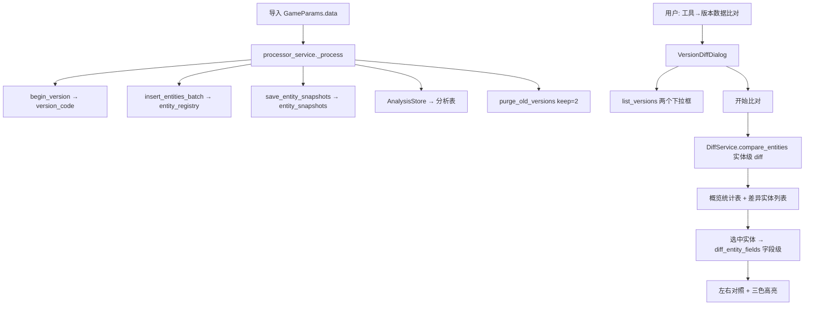

# 版本数据比对功能规划（GameParams 多版本 Diff + 比对界面）

> **✅ 已完成（2026-08-13）** —— 本功能已完整实现并验证通过：
>
> - **快照存储**：新增 `entity_snapshots` 表（`resources/database/database_new.sql` 第 2.5 节 + `database_service.initialize()` 迁移兜底），导入时由 `processor_service._collect_entity` 写入规范化 JSON；`DatabaseManager.save_entity_snapshots` 批量写入（版本级联删除）
> - **比对引擎**：`services/diff_service.py` —— `compare_entities`（实体级 added/removed/modified/unchanged + 按类型统计）、`diff_entity_fields`（字段级 path/base/target/kind）、`build_entity_tree`（完整字段树含差异标记，供信息面板展示）、`build_overview`
> - **比对界面**：`ui/version_diff_dialog.py` 独立对话框（"工具 → 版本数据比对..."）—— 左=差异概览统计表 + 差异实体列表（筛选/搜索），右=信息面板式完整字段展示 + 三色高亮（新增绿/删除红/修改黄）+ 源/目标两列对照 + 分组差异徽标
> - **菜单挂接**：`ui/main_window.py` `_on_open_version_diff`（懒创建单实例，复刻 assets 浏览器）
> - **验证**：`_archive/scripts/test_diff_service.py`、`test_diff_dialog.py` 全部通过

---

> 需求：当**上一次导入的数据**与**这一次导入的数据**不同时，比对两个版本的数据有哪些不同之处，并新建一个界面，对**有变动的数据**进行比对显示。
>
> 基于现有软件代码设计。关联：`services/processor_service.py`、`services/database_service.py`、`services/analysis_service.py`、`ui/main_window.py`、`ui/detail_panel.py`。

---

## 一、现状与目标

### 现状（已有的多版本基础，可直接复用）

- **多版本数据库架构**：所有数据表（`ship_basic_info`、`projectile_basic_info`、gun/plane/consumable 分析表…）均以 `version_code` 为第一主键列，天然实现版本隔离 + 级联删除（`resources/database/database_new.sql`）。
- **版本注册表** `data_version_registry`：`version_id`（自增序）+ `version_code` + `wows_type` + `bin_folder` + `entity_count` + `created_at`。
- **实体注册表** `entity_registry`：`(version_code, entity_id, entity_type, nation)`，每次导入全量注册实体。
- **版本管理 API**（`DatabaseManager`）：
  - `begin_version(game_version, wows_type, bin_folder) → version_code`
  - `list_versions() → list[dict]`（按 version_id 倒序）
  - `get_latest_version_code()`、`get_categories()`、`get_stats()`
  - `purge_old_versions(keep_count=2)` —— 导入完成后只保留**最近 2 个版本**（`processor_service._ok` 内调用）
- **导入流程**（`processor_service.run_process._process`）：
  1. 提取 + 解码 `GameParams.data`（字节逆序 + zlib + pickle）→ `data`（完整实体 dict）
  2. `db.begin_version(...)` → version_code
  3. `insert_entities_batch(db_batch, version_code)` → entity_registry
  4. `AnalysisStore` 写结构化分析表（`store_ship` / gun / projectile / plane…）
  5. 完成后 `purge_old_versions(keep_count=2)`；原始实体 dict 只临时写入 split 目录 JSON（`keep_split_json` 为 False 时删除）
- **UI 挂接模式**：`MainWindow._setup_menu` 的"工具"菜单 → 独立顶层窗口（懒创建单实例，如 `_on_open_assets_viewer` 打开 `AssetsBinViewer`），可完全复刻。

> **结论**：数据库天然保留"上一次版本 + 本次版本"两份数据（keep_count=2），跨版本查询无需额外存储。缺的是**原始字段快照**（分析表字段分散、难以逐实体还原原始 JSON）和**比对引擎/界面**。

### 目标（本规划）

1. **快照存储**：导入时把每个实体的**规范化 JSON** 持久化到新表 `entity_snapshots`（按 version_code 分区，级联删除），保证可做**精确字段级比对**。
2. **比对引擎** `services/diff_service.py`：
   - **实体级 Diff**：两个版本按 `entity_id` 求新增 / 删除 / 修改（快照 JSON 不同）/ 未变
   - **字段级 Diff**：对"修改"实体递归比对快照 JSON，输出差异路径（如 `artillery.A1_Artillery.reload_time`），给出 base 值 → target 值 + 变更类型
   - **概览统计**：按 `entity_type` 分组汇总 added / removed / modified 数量
3. **比对界面** `ui/version_diff_dialog.py`：独立对话框，从"工具"菜单打开；支持选版本、按类型筛选、实体差异列表 + 字段级左右对照显示（高亮新增/删除/修改）。
4. **触发时机**：比对不自动弹出（避免打断导入），仅在用户从"工具 → 版本数据比对…"打开；若版本仅剩 1 个或两个版本相同，界面给出提示。

---

## 二、核心设计

### 1. 实体快照存储（新表 `entity_snapshots`）

```sql
CREATE TABLE IF NOT EXISTS entity_snapshots (
    version_code TEXT NOT NULL REFERENCES data_version_registry(version_code) ON DELETE CASCADE,
    entity_id    TEXT NOT NULL,
    entity_type  TEXT NOT NULL,            -- 'ship','gun','projectile','plane','consumable','modernization','crew'
    nation       TEXT,
    data_json    TEXT NOT NULL,            -- json.dumps(规范化实体 dict, sort_keys=True, ensure_ascii=False)
    json_len     INTEGER DEFAULT 0,        -- 便于统计/抽样
    PRIMARY KEY (version_code, entity_id)
);
CREATE INDEX IF NOT EXISTS idx_snap_type ON entity_snapshots(version_code, entity_type);
```

- **规范化**：与 `processor_service._GPEncode` 一致——序列化前剔除不可序列化字段（`Cameras` / `DockCamera` / `damageDistribution` / `salvoParams`），`json.dumps(..., sort_keys=True)` 保证同数据同文本，可直接字符串比较判"未变"。
- **写入位置**：`database_service.DatabaseManager` 新增 `save_entity_snapshots(items, version_code)`（`executemany` 批量，复用 `insert_entities_batch` 的遍历，`INSERT OR REPLACE`）；在 `processor_service._process` 中与 `insert_entities_batch` 同批收集调用。
- **存储开销**：约 21,000 实体/版本，JSON 合计约 10–30MB/版本；`purge_old_versions` 级联删除旧版本快照，不影响 <2GB 内存约束（写入走 sqlite，不整体驻留内存）。
- **向后兼容**：`database_service.initialize()` 用 `CREATE TABLE IF NOT EXISTS` 迁移补建（参照 `consumable_buff` 迁移模式）。老版本导入的数据无快照 → 界面提示"该版本无快照，仅能做实体级比对"，仍可用 `entity_registry` 做新增/删除集合 diff。

### 2. 比对引擎 `services/diff_service.py`（新建）

```
class DiffService:
    def __init__(self, db: DatabaseManager): ...

    # 版本侧信息
    def list_versions(self) -> list[dict]            # 复用 DatabaseManager.list_versions
    def has_snapshot(self, version_code) -> bool      # 快照表是否有该版本数据

    # 实体级 Diff：base(旧) vs target(新)
    def compare_entities(self, base_vc, target_vc,
                         type_filter=None) -> DiffResult
        # 返回 DiffResult{ added, removed, modified, unchanged, stats }
        # 以 (entity_id, entity_type) 为键；added=仅在 target；removed=仅在 base；
        # modified=两边都有但 data_json 不同；unchanged=相同
        # stats = 按 entity_type 分组的 {added, removed, modified, unchanged} 计数

    # 字段级 Diff（仅 modified 实体，需快照）
    def diff_entity_fields(self, base_vc, target_vc,
                           entity_id) -> list[FieldDiff]
        # 递归比对两版 JSON dict，返回 [{path, kind, base, target}]
        # kind ∈ {added, removed, modified}
        # path 形如 'typeinfo.level' / 'artillery.A1_Artillery.reload_time' / 'modules[2].id'
        # 数值容差：abs(new-old) 小于阈值（如 1e-6）视为未变；None↔缺省键按 removed/added

    # 概览：一次性算实体级 + 字段级计数（供 UI 左栏统计）
    def build_overview(self, base_vc, target_vc) -> dict
```

- 实现要点：全量读两版本 `entity_snapshots` 的 `(entity_id, entity_type, data_json)` 到内存 dict（21,000 条字符串，内存可接受）做集合 diff；**逐实体 JSON 加载只针对 modified 实体**（懒加载字段级）。
- 复用 `database_service._entity_type` 的映射（category → 小写类型）保持一致。

### 3. 比对界面 `ui/version_diff_dialog.py`（新建）

独立 `QDialog`（参照 `AssetsBinViewer` 的独立顶层窗口 + 懒创建单实例模式）：

```
┌─ 版本数据比对 ──────────────────────────────────────┐
│ 源版本 [v26.6.1.0_<bin目录名> ▾]   目标版本 [v26.7.0.0 ▾]  [开始比对] │
│ 类型筛选 [全部 ▾]  搜索 [entity_id 关键字...]          │
├───────────────────────┬─────────────────────────────┤
│ 左：差异概览 + 实体列表   │ 右：字段级差异对照          │
│ ┌───────────────────┐ │ ┌─────────────────────────┐ │
│ │ ship   +12 / -3 / ~5 │ │ 字段路径          旧→新  │ │
│ │ gun    +30 / -1 / ~8 │ │ artillery.A1.reload 6.4→6.2 │
│ │ projectile ...      │ │ ...（逐行高亮）         │ │
│ └───────────────────┘ │ └─────────────────────────┘ │
│ 实体表：added(绿) /      │ 顶部：实体名 + 变更类型 +     │
│        removed(红) /    │      新旧值并排对照          │
│        modified(黄)     │                           │
├───────────────────────┴─────────────────────────────┤
│ 状态/日志栏：比对耗时、总数                            │
└──────────────────────────────────────────────────────┘
```

- **左栏（概览 + 实体列表）**：
  - 顶部 `QTableWidget`：按 entity_type 统计 added / removed / modified / unchanged（可点击行切换类型筛选）
  - 下方 `QTableWidget`：差异实体列表（类型、entity_id、变更类型、字段变更数），按类型/关键字过滤
- **右栏（字段级对照）**：
  - 顶部：实体名 + 变更类型徽标 + 新增/删除/修改计数
  - 主体 `QTreeWidget`（按 path 层级展开）或 `QTextBrowser`（HTML 表格并排 旧值 | 新值）
  - **高亮**：added=绿色、removed=红色、modified=黄色（与左侧一致）
  - 空态：无快照时提示"该版本无快照，仅实体级比对"
- 交互：左栏选中实体 → 右栏懒加载该实体字段 diff（后台线程，避免大实体卡界面，参照 `threading_utils.run_async`）。

### 4. 菜单挂接（`ui/main_window.py` 改动最小）

```
工具菜单
├─ assets.bin 浏览器...      （已有）
└─ 版本数据比对...           （新增 → _on_open_version_diff）
```

- `_on_open_version_diff()`：懒创建单实例 `VersionDiffDialog()`，独立顶层窗口，`show()` + `raise_()` + `activateWindow()`（完全复刻 `_on_open_assets_viewer`）。
- 打开时从 `get_db()` 读取 `list_versions()`；若 <2 个版本，弹提示"数据库只有 1 个版本，需先导入两次数据"。

---

## 三、分步实现方案

### 步骤 1：快照表 + 导入写入
1. `resources/database/database_new.sql`：加 `entity_snapshots` 建表语句（含索引）
2. `database_service.initialize()`：`CREATE TABLE IF NOT EXISTS` 兜底迁移
3. `database_service` 新增 `save_entity_snapshots(items, version_code)`（executemany + INSERT OR REPLACE）
4. `processor_service._process`：收集 db_batch 的同时收集快照（`json.dumps(data, cls=_GPEncode, sort_keys=True, ensure_ascii=False)`），同一事务批量写入
   - 位置：`insert_entities_batch(...)` 之后 / 同一批，随版本级联

### 步骤 2：比对引擎 `services/diff_service.py`
1. `list_versions` / `has_snapshot`（复用 DatabaseManager）
2. `compare_entities(base_vc, target_vc, type_filter)` → 实体级 diff + stats
3. `diff_entity_fields(base_vc, target_vc, entity_id)` → 字段级 diff（递归 + 浮点容差）
4. `build_overview(...)` → 概览
5. 单元验证：构造两个小版本数据（含增/删/改/同），断言 diff 结果

### 步骤 3：比对界面 `ui/version_diff_dialog.py`
1. 版本选择栏（两个 QComboBox + 开始比对）
2. 概览统计表（按类型）
3. 差异实体列表（筛选/搜索）
4. 字段级对照（QTreeWidget / HTML 表格 + 三色高亮）
5. 后台线程加载（run_async）

### 步骤 4：菜单挂接
1. `ui/main_window.py` `_setup_menu` 加"版本数据比对..." action
2. `_on_open_version_diff` 懒创建单实例 + 版本数检查

### 步骤 5：验证
1. 连续导入两个不同版本（或同一版本改 key）→ 打开比对，确认 added/removed/modified 正确
2. 同一实体改单个字段 → 字段级路径 + 新旧值正确显示
3. `purge_old_versions` 后旧快照级联删除、界面版本列表同步
4. 无快照的老版本 → 仅实体级比对 + 提示

---

## 四、数据流 / 时序



---

## 五、内存与存储约束

- **内存**：全量实体快照读入内存（约 21,000 条 JSON 字符串）可接受；字段级 diff 只对 modified 实体懒加载，避免大实体（如 ship 含全部模块）卡 UI。
- **存储**：快照 JSON 约 10–30MB/版本，随版本级联删除，不长期膨胀。
- **比对耗时**：实体级集合 diff 秒级；字段级仅 modified 实体，后台线程执行。

---

## 六、验证方式

1. **快照写入**：导入后 `SELECT count(*) FROM entity_snapshots WHERE version_code=?` 应 ≈ entity_registry 计数（21,000）
2. **实体级**：构造 2 个版本（+1 新船 / -1 旧船 / 改 1 数值），`compare_entities` 统计正确
3. **字段级**：改 `reload_time` 6.4→6.2，`diff_entity_fields` 输出 path=`...reload_time`、kind=modified、base=6.4、target=6.2
4. **级联**：`purge_old_versions` 删除旧版本后，其快照同步清除
5. **UI**：两个下拉框版本可互换（A→B 与 B→A 镜像）、类型筛选/搜索生效、三色高亮正确
6. **兼容**：无快照的老版本仅实体级比对不报错

---

## 参考

- 现有多版本：`services/database_service.py`（`begin_version` / `list_versions` / `purge_old_versions` / `insert_entities_batch`）、`resources/database/database_new.sql`
- 导入流程：`services/processor_service.py`（`_process` / `_GPEncode` / `_finalize_import`）
- 分析写入：`services/analysis_service.py`（`AnalysisStore`）
- UI 挂接范本：`ui/main_window.py` `_on_open_assets_viewer` + `uncode_assets/gui.py::AssetsBinViewer`（独立窗口懒创建单实例）
- 后台线程：`utils/threading_utils.py::run_async`
