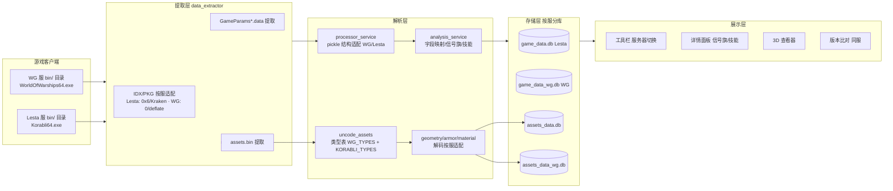

# 新功能：Wargaming（WG）服版本数据兼容

> 状态：**实施中（2026-08-21）**
>
> 实施记录：
> - M0.3 / M1.9（解包层，2026-08-21 完成并验证）：实测 `D:\\World_of_Warships` v13015811，
>   WG `compression_info` = `0x0`(raw) / `0x100000005`(raw-deflate)；`pkg_reader.py` 新增 WG 双模式支持
>   （read_file 整体 + extract_to_file 流式）；`idx_parser.ROOT_PARENT_ID` 修正为 0xDBB1A1D1B108B927。
>   验证：成功从 WG 客户端解出 GameParams.data(16.7MB) 与 assets.bin(179.6MB)，大小与 unpacked_size 完全一致；
>   assets.bin 魔数 BDWB/version 0x01010000 与 wows-toolkit 文档一致。
>   ✅ 交叉验证（tools/wowsunpack.exe，2026-08-21）：随机 8 个文件（raw+deflate，jpg/wem/dds/png/data），
>   本地 read_file 与 extract_to_file 输出与 wowsunpack.exe **逐字节一致**（SHA256 相同）。
>   ⚠️ wowsunpack.exe 正确用法：INPUT 须为 idx 目录（非游戏根），`--packages` 用相对路径，
>   如 `wowsunpack.exe <bin>\<ver>\idx -x -p ../../../res_packages -o <out> -I <文件>`。
> - M0.2 / M1.4（GameParams 解析，2026-08-21 完成）：WG GameParams.data 解压后头部 `%bin` 之谜已解——
>   **处理链与 Lesta 完全相同**（pkg raw-deflate 解压后 → `[::-1]` → zlib.decompress → pickle.loads），
>   `%bin` 只是反转前落在文件头的 pickle 内容字节，非魔数；根结构 `{"": {param: GPData}}`
>   （23585 实体，json.dumps 抽样全通过，与 wows-toolkit reverse+ZlibDecoder 一致）。
>   → **`processor_service` 的 WG 分支直接复用，无需改动**（GameParams 桩类 + sys.modules 注入已具备）。
>   ⚠️ 注意：WG 含 Lesta 没有的 type（如 Radar），`TYPE_CATEGORY_MAP` 未覆盖的类型仍会入库，仅不进分析分类。
> - M1.2 / M1.3（数据库分库，2026-08-21 完成）：`DatabaseManager._db_name` 按服务器分库
>   （Lesta→`game_data.db` 保持旧数据兼容，WG→`game_data_wg.db`）；`AssetsCacheService` 同样分库
>   （`assets_data.db` / `assets_data_wg.db`，构造时默认从 `app_ctx.ctx.wows_type` 取，显式参数也可传）；
>   `_populate_assets_cache` 显式传 wows_type；`geometry_service._get_assets_cache` 按服务器切换重建缓存。
>   分库不改表结构，无需递增 DB_SCHEMA_VERSION（当前 44）；get_db/reset_db/application/toolbar 的
>   切服逻辑原本就按 server 传参，分库后自动生效。单测通过：_db_name 路径派生 Lesta/WG 正确。
> - WG 数据格式差异预留（2026-08-21）：新增 `services/wg_compat.py` 集中管理「Lesta 版 / WG 版」差异
>   （TypeInfo→类别映射、分析类别、实体 JSON 规范化）；`processor_service._cat_map` 与
>   `analysis_service.analyze_one/precompute_all` 已接入钩子。**具体差异内容为占位，待人工按 WG
>   实测填充**（见 4.x 待手动填充清单）；填充前 WG 数据走 Lesta 路径（字段缺失但不崩溃）。
> - 应用内图片按服务器分离（2026-08-21）：`resources/pictures/` 下分 `lesta/`（原 445 图全部移入）
>   与 `wargaming/`（空，用户稍后按同规则补图，缺失即缺失不回退）；新增 `utils/image_paths.py`
>   （`pic_path`/`pic_dir` 按服解析 qrc 路径）；detail_panel / penetration_calculator /
>   crew_customize / analysis_service 的图片引用改为 `pic_path()`；QSS 侧 combo_arrow 由
>   `utils/theme.qss()` 统一按服重写 `:/resources/pictures/` 前缀。验证：Lesta 加载 lesta/ 正常、
>   WG 无图返回空、qrc 重编译自动生效。
> - 连发射击模式兼容（2026-08-22）：确认 WG 与 Lesta 均用 `SwitchableModeArtilleryModule` 识别连发模式
>   （机制通用，老代码 `_archive/analyzers/ship_analyzer.py` 本就是两服兼容基准）；`analysis_service._write_artillery`
>   修复连发间隔读取——`shotDelay` 缺失时兜底 `burstReloadTime`（WG 实测用此字段）。WG 独有
>   `shotIntensity` / `secondaryAmmoList` 词条现有分析器未入库，见 4.x 清单。
> - WG 代码收拢为检修模块（2026-08-22）：`services/wg_compat.py` 成为 WG 兼容**唯一检修入口**——
>   数据差异（类型映射/类别/规范化）、展示占位（信号旗/舰长技能文案）、机制适配预留均收拢于此；
>   新增 `is_wg()` / `signal_flag_placeholder()` / `commander_placeholder()`；`detail_panel` 占位文案
>   改用 wg_compat。检修 WG 兼容只看 wg_compat + 少量接入点（见模块 docstring 检修指南）。
> - 弹夹炮识别双分支化（2026-08-22）：原散在 `analysis_service` 的弹夹炮识别（`store_ship` 收集 +
>   `_write_artillery` 写库，含 `shotDelay or burstReloadTime` 混合判断）收拢为
>   `wg_compat.recognize_burst_gun(module_data, wows_type)` **双分支**——`_recognize_burst_lesta`（原逻辑，
>   勿动）+ `_recognize_burst_wg`（**当前复制 Lesta 版**，带 `TODO(手动)` 标注，供逐点调整 WG 差异：
>   模块键、连发间隔字段 shotDelay/burstReloadTime、字段名语义）。`analysis_service` 改为按服务器调用。
>   验证：两服 Drum→shotDelay=0.8 / Switchable→burstReloadTime=1.5 / chargeTimeParams=[1,2,3] 解析正确。
> - ✅ 写入+展示按服务器文件级分离（2026-08-22）：**Lesta / Wargaming 两个平级大分类直接分开**（非继承）——
>   - 写入层：`services/lesta/analysis.py`（LestaAnalysisStore/Service）+ `services/wargaming/analysis.py`
>     （WargamingAnalysisStore/Service，复制 Lesta 逐点调）；顶层 `services/analysis_service.py` 保留 Lesta 兼容转发。
>   - 展示层：`presenters/lesta/`（LestaBasePresenter/LestaShipPresenter/LestaPresenterRegistry）+
>     `presenters/wargaming/`（Wargaming 三件套，复制 Lesta 逐点调）；顶层 `presenters/registry.py` 按 `is_wg()` 分发，
>     `base_presenter.py`/`ship_presenter.py` 保留 Lesta 兼容转发（detail_panel 等直接 import 不受影响）。
>   - 调用点：`processor_service._run_analysis` 按 `is_wg()` 选 AnalysisService 类。
>   - `processor_service`（拆分 JSON）**不分离**（用户指定，天然双服分流已够用）。
>   - 验证：全导入链通畅、registry 分发 Lesta/WG 正确、临时库两服建表 52 表 + assets 8 表全通过。
> - ✅ SQL 架构按服务器分离（2026-08-22）：`resources/database/` 下 `lesta/` 与 `wargaming/` 各含
>   `database_new.sql` + `assets_database.sql`（WG 版复制 Lesta 并加「独立架构」头注释，逐点调 game_data 结构差异）；
>   顶层旧文件保留作兼容回退。`database_service.initialize` / `assets_cache_service.initialize` 按服务器
>   选子目录 SQL（子目录缺失回退顶层）；`resources.qrc` 已重生成包含子目录，qrc 自动重编译验证通过。
> - ✅ WG 模式跳过 assets.bin（2026-08-22）：`processor_service` 在 WG 服下**不启动** assets 后台缓存任务
>   （`assets_done` 直接置位、标记成功，主流程不等待不终止），`_populate_assets_cache` 开头 WG 直接返回 True
>   （双保险）。原因：WG 的 assets.bin 格式（10 类型表）尚未适配（见 M1.6）。Lesta 路径不受影响。
>
> 本计划针对「对 wg 服版本的数据兼容」，覆盖 **数据提取 → 数据解析 → 数据存储 → 数据展示 → 本地化** 全链路，
> 目标是让程序在 WG 服客户端上同样能「加载数据 → 解析入库 → 浏览舰船/火炮/炮弹/消耗品/升级品/舰长 → 3D 查看 → 跨版本比对」。
>
> 前置依赖：需要一份 **WG 服客户端**（或至少其数据文件）做**验证**（见 M0），否则后续任务无法落地。
> 当前 `README.md` 声明「目前这个版本不支持 Wargaming 服」，本计划完成后需同步更新该声明。
>
> 格式来源策略：WG 服数据格式**优先直接借鉴 [wows-toolkit](https://github.com/landaire/wows-toolkit)（Rust，面向 WoWS/WG 逆向）**
> 已文档化的实现（`docs/MODELS.md`、`crates/wowsunpack/src/models/assets_bin.rs`、`game_params/*`），
> 本地 `_temp/scripts/` 探针仅用于**验证 + 差异确认**，不做从零逆向（详见 2.3）。

---

## 1. 目标与范围

### 目标
1. WG 服客户端（`World_of_Warships/bin/<版本号>/...`，主程序 `WorldOfWarships64.exe`）能端到端完成
   「提取 GameParams + assets.bin → 解析拆分 → 写入数据库 → UI 展示 → 3D 查看」。
2. WG 与 Lesta 两套服务器数据**互不污染**：数据库、缓存、Presenter 缓存、版本比对均按服务器隔离。
3. WG 特有/差异机制（信号旗、舰长技能、消耗品、字段结构、3D 几何格式）按实证结果适配，不简单套用 Lesta 假设。
4. 不回归 Lesta 服现有功能。

### 范围
- **内**：数据提取、GameParams 解析、assets.bin/3D 解码、数据库分库、展示层（信号旗/舰长技能/字段映射）、本地化、跨服隔离。
- **外**（本期不做）：WG 专有新玩法深度还原、双服数据并排比较（不同服版本号不可比）、WG 客户端自动下载。

---

## 2. 现状盘点：架构预留 vs 缺口

### 2.1 已经打通的基础层（WG 架构位已预留）
| 层 | 文件 | 现状 |
|----|------|------|
| 配置 | `app/config.py` | `wows_type: "Wargaming" \| "Lesta" \| "未选择"` 已贯穿 |
| 信号 | `app/signals.py` | `wows_type_changed` 已存在 |
| 应用上下文 | `app/application.py` | `set_wows_type()` + `ctx.wows_type` 已实现 |
| 提取 | `services/extractor_service.py` | `_read_exe_version` 已按 `wows_type` 区分 exe 名（WG=`WorldOfWarships64.exe`）；`GameParams*.data` 通配提取已兼容 |
| 解析 | `services/processor_service.py` | **已能解析 WG 的 pickle 结构**：`gpd[::-1]` + zlib + `pickle.loads(encoding='latin1')`，`source_dict = {'' : dict}` 分支 → `msg = "Wargaming 拆分完成"` |
| 解析 | `services/GameParams.py` | WG pickle 反序列化所需桩类（`TypeInfo/GPData/GameParams/UIParams`）已存在 |
| 容器 | `data_extractor/idx_parser.py` | IDX 条目布局 v0x40 与 wows-toolkit 一致（但**根节点判定、PKG 压缩语义为 Lesta 实测**，见 G16/G17） |
| 本地化 | `services/localization_service.py` | 已分 WG「复制客户端 global.mo」/ Lesta「下载」两分支 |

### 2.2 已确认的兼容缺口（本计划要解决）
| # | 层 | 缺口 | 位置 |
|---|----|------|------|
| G1 | 存储 | ✅ 已解决（2026-08-21）：`_db_name` 按服务器分库（Lesta→`game_data.db`，WG→`game_data_wg.db`） | `services/database_service.py` |
| G2 | 存储 | ✅ 已解决（2026-08-21）：`AssetsCacheService` 按服务器分库（`assets_data.db`/`assets_data_wg.db`），geometry_service 切服重建缓存 | `services/assets_cache_service.py` |
| G3 | UI | `rb_wg`（Wargaming 单选按钮）**被禁用** | `ui/toolbar_widget.py` L116 |
| G4 | 展示 | WG 信号旗显示占位「暂不支持信号旗系统」 | `ui/detail_panel.py` L709-716 |
| G5 | 展示 | WG 舰长技能显示占位「暂不支持舰长技能系统」 | `ui/detail_panel.py` L967-974 |
| G6 | 解析 | `uncode_assets/types.py` 仅 `KORABLI_TYPES`（12 类型），WG 只有 10 类型且 blob index 映射不同 | `uncode_assets/types.py` |
| G7 | 解析 | 3D 几何/装甲/材质解码（`.geometry` 布局、装甲 BVH、碰撞材质 id、MaterialPrototype 布局）全部按 Korabli 实测 | `models/geometry_parser.py`、`models/armor_scene.py`、`models/collision_materials.py`、`services/assets_cache_service.py` |
| G8 | 解析 | GameParams 字段结构：WG 与 Lesta 的实体字段/`TypeInfo.type`/`TYPE_CATEGORY_MAP` 可能不同 | `services/processor_service.py`、`services/analysis_service.py` |
| G9 | 本地化 | ✅ 已解决（2026-08-22）：WG 分支从 `bin/<版本>/res/texts/zh_sg/LC_MESSAGES/global.mo` 复制（优先 `ctx.bin_folder`，回退最新版本目录、回退 zh_cn）→ polib 转 PO → 提取；`bin_root` 未定义 bug 已修复 | `services/localization_service.py` |
| G10 | 展示 | 信号旗槽位模型（Lesta 6 槽 `SIGNAL_SLOTS`）与 WG 是否一致待实证；`signal_flags` 表按 Lesta `PCEF` 前缀入库 | `presenters/ship_presenter.py`、`services/analysis_service.py` L1516 |
| G11 | 展示 | 舰长技能布局 `skill_service._grid_map` 为 Lesta 4x4 + rarity（COMMON/REGULAR/RARE/EPIC/LEGENDARY）硬编码；WG 无 rarity、布局不同 | `services/skill_service.py`、`services/analysis_service.py` L1560 |
| G12 | 展示 | `MODIFIER_MAP` / `NATION_MAP` 等静态映射可能缺 WG 特有字段/国籍 | `models/name_mapping.py`、`presenters/ship_presenter.py` |
| G13 | 解析 | 射界/朝向制：`utils/firing_arc.py`、`models/armor_scene.py` 按 Lesta ±180° 制注释，WG 是否一致待实证 | `utils/firing_arc.py` |
| G14 | 比对 | `version_diff_dialog.py` 读 `wows_type` 字段 → 分库后需保证**同服内**跨版本比对 | `ui/version_diff_dialog.py` |
| G15 | 资源 | 信号旗/舰长技能图标资源（`resources/pictures/signal_flags`、`resources.qrc`）为 Lesta 素材，WG 需另行确认来源 | `resources/`、`resources.qrc` |
| G16 | 解包 | ✅ 已解决（2026-08-21）：WG 实测 `compression_info` = `0x0`(raw) / `0x100000005`(raw-deflate)；`pkg_reader.py` 已支持双模式 | `data_extractor/pkg_reader.py` |
| G17 | 解包 | ✅ 已解决（2026-08-21）：WG 根 parent_id 全部 == `0xDBB1A1D1B108B927`（45 条），「parent not in map」判定一致；`ROOT_PARENT_ID` 常量已修正（原 DD 笔误→DB） | `data_extractor/idx_parser.py` |
| G18 | 解包 | **Kraken 解压 / bc7prep 纹理为 Lesta 特有**：WG 容器用 deflate、无 bc7prep 位重排 → WG 场景不加载 `kraken.py`（GPLv3）与 `bc7prep.py` | `data_extractor/kraken.py`、`data_extractor/bc7prep.py` |

### 2.3 可直接借鉴的 WG 格式（wows-toolkit 已文档化）

wows-toolkit（`landaire/wows-toolkit`）面向 **WoWS（WG 服）** 逆向，其 `docs/MODELS.md` 与
`crates/wowsunpack/src/models/assets_bin.rs`、`crates/wowsunpack/src/game_params/*` 已给出下述 WG 格式的
完整字段布局，**可直接作为初始实现基线**；本地探针只做真实验证与差异确认。

#### WG `assets.bin` Prototype 类型表（10 个，与 Korabli 12 个不同）

| Idx | Type | Magic | item_size | 与 Korabli 的对应关系 |
|-----|------|-------|-----------|----------------------|
| 0 | MaterialPrototype | 0x5069C471 | 0x78 | 同 magic，Korabli item_size=0x88 |
| 1 | VisualPrototype | 0x480DC57B | 0x70 | 同 magic，Korabli item_size=0x40 |
| 2 | SkeletonExtenderPrototype | 0x1AE023FF | 0x20 | 无对应（Korabli 为 SkeletonPrototype 0xD9BB9F4A，index 1） |
| 3 | ModelPrototype | 0xA9576F28 | 0x28 | 同 magic，Korabli item_size=0x20 |
| 4 | PointLightPrototype | 0x0D3665A4 | 0x70 | 无对应 |
| 5 | EffectPrototype | 0xEB23E0AF | 0x10 | 相同（Korabli index 5） |
| 6 | VelocityFieldPrototype | 0xAFD4A63F | 0x18 | 无对应 |
| 7 | EffectPresetPrototype | 0x42E15336 | 0x10 | 相同（Korabli index 6） |
| 8 | EffectMetadataPrototype | 0xDFC8F8E0 | 0x10 | 相同（Korabli index 7） |
| 9 | AtlasContourProto | 0xF64359AA | 0x10 | 相同（Korabli index 8） |

- 关键结论：**Material / Visual / Model 三型 magic 两服相同但 item_size 不同**
  （WG 0x78/0x70/0x28，Korabli 0x88/0x40/0x20），**blob index 映射整体不同**；
  WG 无 Skeleton/Trail/VfxMaterial/MiscSettings/ModelFbx，多出 SkeletonExtender/PointLight/VelocityField。
- 影响：`WG_TYPES` 不能复用 `KORABLI_TYPES` 的 item_size/index，须按上表独立建表，**仍按 magic 识别**；
  且类型识别后必须用**当前服的 item_size** 取记录步长（不能按 magic 单值查 item_size）。

#### WG `GameParams.data` pickle 结构（`game_params_to_pickle` / `params_from_data`）

- 字节流：`data.reverse()` + zlib 解压（与现有 `processor_service` 一致）；
- 根结构（三态，与现有 WG 分支一致）：
  - 现代格式：`{"": {param_key: data}}`（我们已走 `source_dict` 分支）；
  - 旧版：扁平 dict（无 `''` 包裹键）；
  - list/tuple：取第 0 个元素再按上述规则（我们已走列表分支）；
- pickle 选项：`replace_unresolved_globals` + `replace_reconstructor_objects_structures` +
  `replace_recursive_structures` + `decode_strings`（先 UTF-8 后 latin1）→ 等价于 `services/GameParams.py`
  桩类 + `pickle.loads(encoding='latin1')`（已实现）；
- 字段对照：`game_params/types.rs` 的 `ParamType` 枚举（Ability/Achievement/Aircraft/Crew/Gun/Modernization/
  Projectile/...）与各类型 builder 字段，可作 `TYPE_CATEGORY_MAP` 与 `analysis_service` 适配的对照清单。

#### WG `.geometry` / 装甲

- `crates/wowsunpack/src/models/geometry.rs` + `docs/MODELS.md`（含 Armor System RE）已文档化，
  与现有 `models/geometry_parser.py` 同源；实证仅需确认 WG 服未引入新的分叉偏移。

#### WG IDX / PKG 解包（`crates/wowsunpack/src/data/idx.rs` + `idx_vfs.rs`）—— 已实测确认（2026-08-21）

- **IDX 条目布局与本地一致** ✅（实测解析 228 个 idx / 421041 条树条目成功）；
- **根节点判定**：WG 根条目 parent_id 全部 == `0xDBB1A1D1B108B927`（45 条）；本仓库「parent not in map」
  方法与 wows-toolkit「parent == ROOT_PARENT_ID」方法在实测数据上结果一致；
  ⚠️ 本仓库原常量 `0xDDB1A1D1...`（DD）为笔误，已修正为 `0xDBB1A1D1...`（DB）；
- **PKG 压缩语义（实测）**：WG `compression_info` = `0x0`(raw) / `0x100000005`(raw-deflate)；
  wows-toolkit 的「非0=DeflateDecoder」方向正确但具体取值不同；
  `pkg_reader.py` 已新增 WG 双模式分支（read_file 整体 + extract_to_file 流式），WG 不触发 Kraken/bc7prep；
- 路径约定：WG 与 Lesta 均为 `bin/<版本>/idx/*.idx` + `res_packages/*.pkg`、`content/GameParams.data`，
  本地 `GameExtractor` 目录推断已复用成功；
- ⚠️ ~~新发现：WG `content/GameParams.data` 解压后头部为 `%bin`~~ ✅ 已解决（2026-08-21）：`%bin` 是反转前落在文件头的
  pickle 内容字节，非魔数；处理链与 Lesta 相同（`[::-1]`+zlib+pickle），`processor_service` 直接复用。

---

## 3. 总体架构设计（数据兼容分层）

### 3.1 关键设计决策

**决策 D1 — 数据库按服分库（推荐）**
- `DatabaseManager._db_name(wows_type)` 改为：
  - `""` / `"Lesta"` → `game_data.db`（保持旧数据兼容，不迁移）
  - `"Wargaming"` → `game_data_wg.db`
- 同理 `assets_data.db`（Lesta） / `assets_data_wg.db`（WG）。
- 依据：`get_db(wows_type)` 与 `_on_server` 切换逻辑**已按 server 语义调用** `get_db(server)`，分库即让该设计意图真正生效；
  天然隔离两服数据与版本记录，杜绝跨服串用与版本比对污染。
- `meta` 表 `wows_type` 字段保留，作为版本记录标记（便于日志/审计）。

**决策 D2 — 类型识别按 magic 双表共存**
- `uncode_assets` 保持「按 magic 识别」主机制（机制通用），新增 `WG_TYPES` 表；
- `WG_TYPES` 基线直接采用 wows-toolkit 已文档化的 WoWS 10 类型表（magic/item_size/blob_index 见 2.3），
  本地探针仅验证；`KORABLI_TYPES`（12 类型）保持不变；
- `type_from_magic` 先查当前服类型表，兜底查另一表。⚠️ 注意 Material/Visual/Model 三型 magic 两服相同
  但 item_size 不同——**类型识别后必须用当前服的 item_size 取记录步长**，不能按 magic 单值复用；
- 按 `wows_type` 选择默认表（`get_types(wows_type)` 门面）。

**决策 D3 — WG 展示逻辑不硬编码 Lesta 假设**
- 信号旗/舰长技能/字段映射一律以 M0 实证结果为准；已新增 **`services/wg_compat.py`** 集中管理
  「Lesta 版 / WG 版」差异（TypeInfo→类别映射、分析类别/标签、实体 JSON 规范化），避免散落 `if wows_type`；
- `processor_service`（拆分时 `_cat_map`）与 `analysis_service`（`analyze_one` normalize +
  `precompute_all` 类别/标签）已接入钩子；WG 差异内容为占位，待人工填充（见 4.x）。

---

## 4. 分阶段实施计划

### 里程碑 M0 — 前置实证（阻塞性前提）

> 没有 WG 客户端数据，G6/G7/G8/G10/G11/G13/G16/G17 全部无法落地。**需用户提供 WG 服客户端路径**（如 `D:/World_of_Warships/bin/<版本>/...`）或 WG 数据文件。

| # | 任务 | 产出 | 落点 |
|---|------|------|------|
| M0.1 | 确认 WG 客户端路径、bin 版本目录、主程序名 | 路径记录 | `_temp/scripts/` 探针 |
| M0.2 | ✅ 验证 GameParams pickle 结构（2026-08-21）：WG 处理链 = `[::-1]`+zlib+pickle（与 Lesta 相同），根结构 `{"": {param: GPData}}`，23585 实体；与 wows-toolkit `reverse()+ZlibDecoder` 一致 | 结构样本（已确认） | `_temp/scripts/verify_wg_gameparams.py` |
| M0.3 | ✅ 实证 IDX/PKG 解包差异（2026-08-21）：WG `compression_info` = `0x0`(raw) / `0x100000005`(raw-deflate)；根节点 parent_id 全部 == `0xDBB1A1D1B108B927`（45 条），「parent not in map」方法判定一致 | 差异清单（已确认） | `_temp/scripts/probe_wg_idx_pkg.py` |
| M0.4 | WG `assets.bin` 类型表：**基线直接用 wows-toolkit 10 类型表（见 2.3）**，用真实 WG assets.bin 验证 magic/item_size/blob_index | `WG_TYPES` 数据表 | `_temp/scripts/` + `docs/` |
| M0.5 | 验证 `.geometry` / `.model` / `.visual` / 装甲 BVH / 碰撞材质 id 布局（**基线参考 wows-toolkit geometry.rs + MODELS.md，仅确认分叉**） | 差异清单 | `_temp/scripts/` |
| M0.6 | 实证信号旗：Exterior 实体命名（`PCEF*`? `PCF*`?）、`signalType`/槽位、rarity 有无 | 差异清单 | `_temp/scripts/` |
| M0.7 | 实证舰长技能：`PCOK`/`PCOL` 结构、rarity 有无、技能树布局 | 差异清单 | `_temp/scripts/` |
| M0.8 | 实证 WG 客户端 `global.mo` 路径（`zh_sg`/`zh_cn`）与编码 | 路径确认 | `_temp/scripts/` |
| M0.9 | 汇总产出 `docs/wg-server-data-format.md`（WG 格式差异说明） | 文档 | `docs/` |
| M0.10 | 确认 WG `assets.bin` 提取路径与 `content/` 结构（GameParams / 本地化文件路径） | 路径清单 | `_temp/scripts/` |

### 里程碑 M1 — 数据链路打通（提取 → 解析 → 入库）

| # | 任务 | 说明 | 相关文件 |
|---|------|------|----------|
| M1.1 | ✅ 已完成（2026-08-22）：`run_localization` WG 分支 `bin_root` 未定义 bug 已修复（改用 `ctx.bin_folder` 优先，回退 `find_latest_bin_folder`）；真实 global.mo 实测通过（PO 54194 条） | `services/localization_service.py` |
| M1.2 | ✅ 数据库分库（2026-08-21）：`_db_name` 按 `wows_type` 返回（Lesta→`game_data.db`，WG→`game_data_wg.db`）；`get_db`/`reset_db` 联动原已按 server 传参，分库后自动生效 | 分库不改表结构，无需递增 `DB_SCHEMA_VERSION`（当前 44） | `services/database_service.py` |
| M1.3 | ✅ `assets_data.db` 分库（2026-08-21）：`AssetsCacheService` 构造按 `wows_type` 派生（`assets_data.db`/`assets_data_wg.db`），`_populate_assets_cache` 显式传；`geometry_service._get_assets_cache` 切服重建 | `ASSETS_SCHEMA_VERSION` 无需递增（不改表结构） | `services/assets_cache_service.py`、`services/geometry_service.py` |
| M1.4 | ✅ GameParams 解析适配 WG（2026-08-21）：`processor_service` 的 WG 分支（`[::-1]`+zlib+pickle+`{'':...}`）**直接复用，无需改动**；桩类注入已验证跑通 23585 实体 | 复用确认 | `services/processor_service.py` |
| M1.5 | ⏳ 差异预留骨架完成（2026-08-21）：新增 `services/wg_compat.py` + `processor_service._cat_map` / `analysis_service` 钩子；**WG 具体差异映射待人工填充**（见 4.x） | 未填充时 WG 走 Lesta 路径 | `services/wg_compat.py`、`services/processor_service.py`、`services/analysis_service.py` |
| M1.6 | `uncode_assets` 新增 `WG_TYPES` 表 + `get_types(wows_type)` 门面 | 按 M0.4 实证数据 | `uncode_assets/types.py`、`uncode_assets/__init__.py` |
| M1.7 | 3D 解码适配 WG：geometry/armor/collision/material（按 M0.5） | 不确定处降级跳过，不阻塞主链路 | `models/geometry_parser.py`、`models/armor_scene.py`、`models/collision_materials.py`、`services/assets_cache_service.py` |
| M1.8 | 端到端跑通 WG 客户端：加载数据 → 解析 → 入库成功，日志「Wargaming 拆分完成」 | 验收点 | 全链路 |
| M1.9 | ✅ `pkg_reader` / `idx_parser` 兼容 WG 解包（2026-08-21 完成）：新增 `0x0`=raw / `0x100000005`=raw-deflate 分支（read_file 整体 + extract_to_file 流式）；`ROOT_PARENT_ID` 修正为 0xDBB1A1D1B108B927 | 已实现并实测解出 GameParams.data/assets.bin，大小与 unpacked_size 一致 | `data_extractor/pkg_reader.py`、`data_extractor/idx_parser.py` |

### 里程碑 M2 — 展示层适配

| # | 任务 | 说明 | 相关文件 |
|---|------|------|----------|
| M2.1 | ⏳ 部分完成（2026-08-21）：`rb_wg` 按钮锁定已去掉（`ui/toolbar_widget.py`）；`_sync_server`/`_on_server` 切换逻辑原有，分库后自动生效。⚠️ 切到 WG 后「加载数据」需 `game_path` 指向 WG 客户端；且完整入库仍受 M1.6（WG_TYPES）限制（assets 缓存失败即终止） | 切服时显示「已切换 / 为空需加载 / 结构已更新」 | `ui/toolbar_widget.py` |
| M2.2 | WG 信号旗系统：去掉占位，按 M0.6 实证适配槽位/类型/图标/加成合并 | `signal_flags` 表结构可能需兼容 WG 字段 | `ui/detail_panel.py`、`presenters/ship_presenter.py`、`services/analysis_service.py` |
| M2.3 | WG 舰长技能系统：去掉占位，`_grid_map` 按 WG 布局、rarity 适配 | Lesta 的 rarity 列在 WG 为固定档位 | `ui/detail_panel.py`、`services/skill_service.py`、`services/analysis_service.py` |
| M2.4 | `name_mapping.MODIFIER_MAP` / `ship_presenter.MODIFIER_MAP` 补 WG 特有 modifier | 按 M0 实证 | `models/name_mapping.py`、`presenters/ship_presenter.py` |
| M2.5 | 本地化资源：WG 信号旗/技能图标来源确认（客户端提取 or 复用 Lesta 素材） | 涉及打包体积与版权 | `resources/`、`resources.qrc` |
| M2.6 | 射界/朝向按实证统一（Lesta ±180° 制 vs WG 制） | 若 WG 制不同，`firing_arc`/`armor_scene` 需分服 | `utils/firing_arc.py`、`models/armor_scene.py` |

### 里程碑 M3 — 隔离 / 比对 / 文档 / 验证

| # | 任务 | 说明 | 相关文件 |
|---|------|------|----------|
| M3.1 | 跨服数据隔离验证：Lesta ↔ WG 切换互不污染（库、缓存、Presenter 缓存） | `PresenterRegistry.clear_cache()` 需在切服时触发 | `presenters/registry.py`、`ui/toolbar_widget.py` |
| M3.2 | 版本比对限定同服：`version_diff_dialog` 按 `wows_type` 过滤 | 跨服版本号不可比 | `ui/version_diff_dialog.py` |
| M3.3 | 新增 `docs/wg-server-data-format.md`（由 M0.9 演进） | 记录 WG 格式差异与实证依据 | `docs/` |
| M3.4 | 更新 `README.md`：移除「不支持 Wargaming 服」声明，改述双服支持状态 | | `README.md` |
| M3.5 | 回归验证 Lesta 服全部功能 | 不回归 | 全链路 |
| M3.6 | Nuitka 打包验证（WG 分库、图标资源、证书） | | `build.bat` |

### 4.x ⚠️ WG 数据格式差异待手动填充清单（2026-08-21）

> 以下为 `services/wg_compat.py` 中的**占位项**，需按 WG 实测 GameParams JSON 结构人工填充。
> 填充后程序对 WG 数据的拆分/分析即走 WG 专用映射；未填充前一律回退 Lesta 逻辑（不崩、字段可能缺失）。

| 占位 | 说明 | 判定依据 |
|------|------|----------|
| `WG_TYPE_CATEGORY_MAP` | WG 的 TypeInfo.type → 分析类别映射（若与 Lesta 的 `TYPE_CATEGORY_MAP` 不同） | 对比 WG/Lesta 的 `typeinfo.type` 集合 |
| `WG_CATEGORIES` | WG 分析类别列表（若类别增删，如 WG 无/有 Radar 等） | WG split 目录类别清单 |
| `WG_CAT_LABELS` | WG 类别中文标签（若类别变化） | 同上 |
| `WG_NORMALIZE_ENTITY` | 函数 `(raw: dict) -> dict`，把 WG 实体 JSON 字段重命名/结构对齐到内部统一结构 | 对比 WG/Lesta 同一实体（Ship/Gun/Projectile 等）JSON 字段差异 |
| （后续 M2.x） | 信号旗槽位、舰长技能布局、`MODIFIER_MAP` 补 WG 特有字段 | M0.6/M0.7 实证 + 展示层适配 |
| 连发射击模式词条（2026-08-22 已确认） | WG `SwitchableModeArtilleryModule` 连发间隔用 `burstReloadTime`（已修复兜底）；WG 独有 `shotIntensity` / `secondaryAmmoList` / `secondaryAmmoPool` 现有分析器未入库 | WG 舰船 JSON（PASC720_Hawaii / PFSC111_Conde） |

### 4.x WG 实测 split 类型分布（2026-08-21，供填充 wg_compat 参考）

> `data/split/` 已按 WG 服模式生成（23585 实体）。以下为 WG 实测 TypeInfo.type 分布，
> 与 Lesta 有明显差异（WG 特有 `Unit`/`BattleCard`/`Reward`/`Campaign` 等，且 Gun/Ship 等数量不同）。

| type | 数量 | 当前 Lesta TYPE_CATEGORY_MAP 是否覆盖 |
|------|------|-------------------------------------|
| Unit | 7153 | ❌ 未覆盖（WG 特有，最大类） |
| Projectile | 3140 | ✅ |
| Gun | 2363 | ✅ |
| Exterior | 2328 | ✅ |
| Collection | 1343 | ❌ |
| Ship | 1209 | ✅ |
| Aircraft | 867 | ✅ |
| Other | 699 | ✅ |
| Crew | 657 | ✅ |
| DogTag | 632 | ❌ |
| Director | 531 | ❌ |
| Achievement | 430 | ❌ |
| BattleCard | 403 | ❌ WG 特有 |
| Campaign | 347 | ❌ |
| Radar | 341 | ❌ |
| Finder | 317 | ❌ |
| Ability | 201 | ✅ |
| Modernization | 118 | ✅ |
| Reward | 109 | ❌ WG 特有 |
| Catapult | 103 | ❌ |
| Building | 95 | ❌ |
| ClanSupply | 93 | ❌ |
| BattleScript | 80 | ❌ |
| Component | 16 | ❌ |
| Sfx | 10 | ❌ |

> 结论：填充 `WG_TYPE_CATEGORY_MAP` 时至少需覆盖上表「未覆盖」的类型（尤其 Unit/BattleCard/Reward/
> Campaign 等 WG 特有类），或决定其归属类别（如 `Unit`→`Other`、`Radar`→`Other`）。

---

## 5. 验证计划

### 探针 / 自动化（`_temp/scripts/`）
- M0 各探针一次性脚本，输出结构化差异报告，比对 Korabli 同字段；
- 分库后单元验证：`_db_name("")=="game_data.db"`、`_db_name("Wargaming")=="game_data_wg.db"`；
- 双类型表：用 WG `assets.bin` 实测 `type_from_magic` 全部命中、item_size 正确。

### 端到端验收（WG 客户端）
1. 「加载数据」→ 提取 GameParams + assets.bin 成功；
2. 「解析」→ 日志「Wargaming 拆分完成」，入库实体数正常；
3. 左侧分类浏览：舰船/火炮/炮弹/消耗品/升级品/舰长均有数据；
4. 详情面板：信号旗可选且加成合并正确；舰长技能树布局正确、技能效果显示；
5. 3D 查看器：WG 舰船可载入、装甲查看/射界显示正常（或明确降级提示）；
6. 「加载文本」→ WG 复制 global.mo 成功，中文名称正常；
7. 切换 Lesta ↔ WG → 各自数据正确隔离，无串库；
8. 版本比对仅在当前服务器内进行。

---

## 6. 风险与决策点

| 风险 | 等级 | 缓解 |
|------|------|------|
| 无 WG 客户端数据 → M0 实证阻塞，整个计划卡住 | 高 | 向用户索取 WG 客户端路径或数据文件；先做不依赖数据的部分（M1.1/M1.2/M1.3 分库） |
| Lesta/WG 分叉大：字段、信号旗/舰长技能/消耗品机制、3D 格式可能不兼容 | 高 | M0 逐项实证；3D/装甲不兼容处降级跳过并提示，不阻塞主链路 |
| 分库改变数据结构 → `DB_SCHEMA_VERSION` 递增会整库重建清空 Lesta 数据 | 中 | 分库**不改表结构**时无需重建；若需改表，先在文档/启动时提示用户 |
| WG 信号旗/技能图标资源缺失 | 中 | 从客户端提取；或复用 Lesta 素材（标注差异）；控制打包体积 |
| WG 服版本号格式（`FileVersion` 语言块）与 Lesta 不同 | 低 | `_read_exe_version` 已遍历多语言块，实证确认 |

---

## 7. 相关代码与文件（速查）

- 配置/上下文：`app/config.py`、`app/application.py`、`app/signals.py`
- 提取：`services/extractor_service.py`、`data_extractor/*`
- 解析：`services/processor_service.py`、`services/GameParams.py`、`services/analysis_service.py`、`uncode_assets/types.py`、`uncode_assets/decoders.py`
- 3D：`models/geometry_parser.py`、`models/armor_scene.py`、`models/collision_materials.py`、`services/assets_cache_service.py`、`services/geometry_service.py`
- 存储：`services/database_service.py`（`DB_SCHEMA_VERSION`=41）、`data/database_new.sql`、`services/assets_cache_service.py`（`ASSETS_SCHEMA_VERSION`=7）
- 展示：`ui/toolbar_widget.py`、`ui/detail_panel.py`、`presenters/ship_presenter.py`、`services/skill_service.py`、`models/name_mapping.py`
- 本地化：`services/localization_service.py`（含 `bin_root` bug）、`utils/po_utils.py`
- 比对：`ui/version_diff_dialog.py`
- 参考：`docs/gameparams-format.md`、`docs/prototype-formats.md`、`docs/assets-bin-format.md`、`docs/geometry-format.md`
